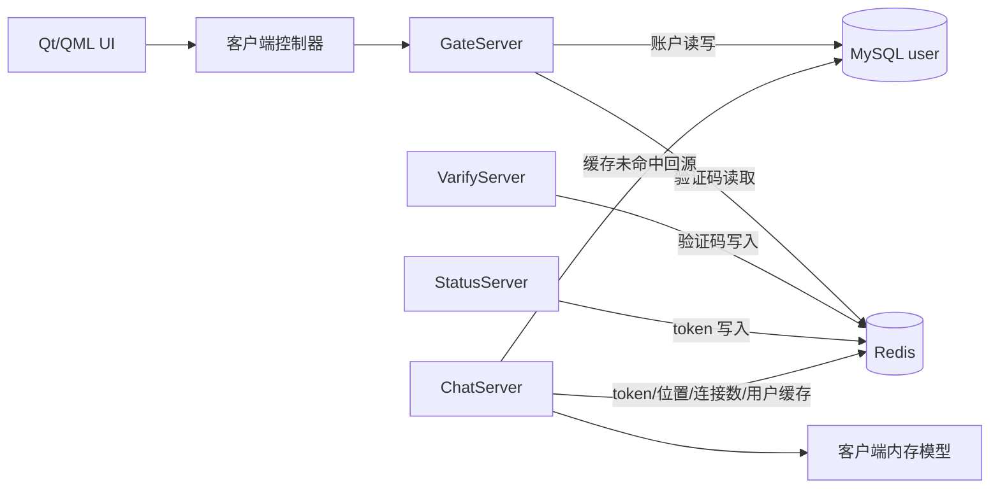
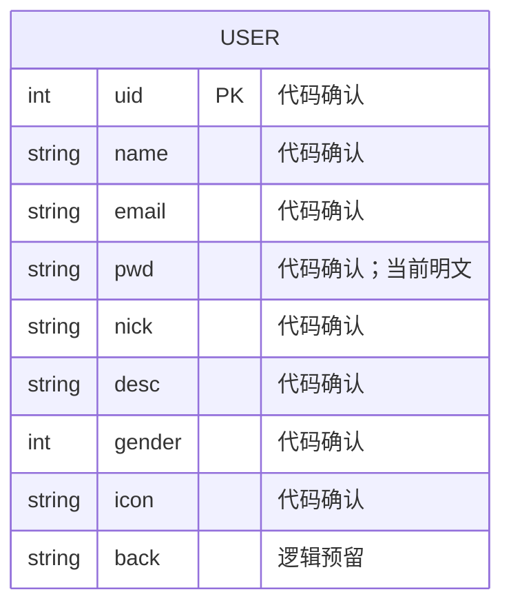
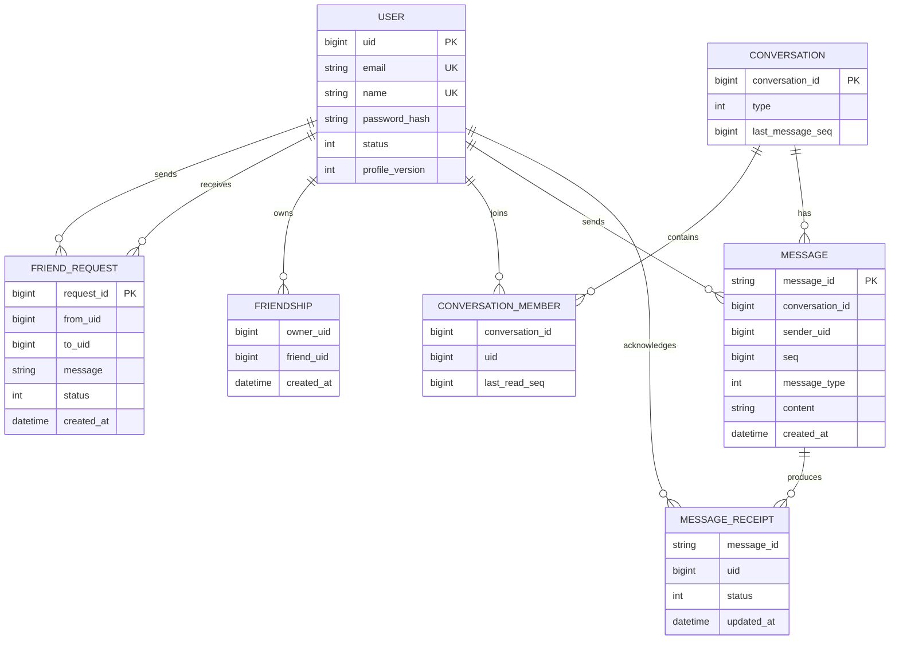

# SakuraChat 数据设计文档

## 1. 文档信息

| 项目 | 内容 |
| --- | --- |
| 文档名称 | SakuraChat 数据设计文档 |
| 文档版本 | 1.1 |
| 编制日期 | 2026-08-08 |
| 更新日期 | 2026-09-08 |
| 覆盖范围 | MySQL 账户数据、Redis 临时状态与缓存、客户端内存模型、数据生命周期和一致性 |
| 代码基线 | 当前工作区源码、`llfc.sql`、`llfc2.sql` 与 `database/schema.sql` |
| 关联文档 | `docs/SYSTEM_ARCHITECTURE_AND_TECHNICAL_DESIGN.md`、`docs/INTERFACE_DESIGN.md` |

### 1.1 可信度说明

仓库根目录包含历史 `llfc.sql` 和 `llfc2.sql` dump；`database/schema.sql` 是在其基础上整理的新库定义，`database/migrate_from_llfc2.sql` 提供无破坏数据迁移。历史 dump 含测试数据和明文密码，不作为正式初始化脚本。本文将数据定义分为：

- **代码确认**：可由 DAO、历史 SQL、结构体或 Redis 操作直接确认。
- **逻辑预留**：结构体或协议中存在，但数据库读取被注释或没有持久化实现。
- **新库设计**：已落入 `database/schema.sql`，好友申请、审核及待处理查询已接入共享 DAO，消息部分尚未接入。

本文不会把推断字段长度、数据库类型或约束描述成现状事实。本次仅静态核对源码及脚本，未连接数据库、导入或测试。脚本定义不等于运行环境已部署；好友完成度与剩余缺口见 [当前状态](FRIEND_FEATURE_STATUS.md)。

## 2. 数据架构

### 2.1 数据存储职责

| 存储 | 数据角色 | 当前数据 | 持久性 |
| --- | --- | --- | --- |
| MySQL | 权威主数据 | 用户账户、好友申请及双向好友关系 | 持久化 |
| Redis | 验证、会话、位置和缓存 | 验证码、token、用户节点、节点登录数、用户基础信息缓存 | 部分应为短期，但当前多项无 TTL |
| 客户端内存 | UI 状态 | 最近会话、联系人、好友申请、消息气泡、当前用户状态 | 进程退出即丢失 |
| 配置文件 | 运行参数和秘密 | 服务地址、数据库/Redis/SMTP 凭据 | 文件持久化；不应继续保存生产秘密 |

历史 `llfc2.sql` 已包含基础消息表；新库将其完善为有会话序号、幂等键、逐用户回执和 Outbox 的消息模型。当前 C++ 服务尚未接入这些表，也仍没有对象存储或搜索索引。

### 2.2 数据流



## 3. 数据所有权

| 数据域 | 当前权威来源 | 主要写入方 | 主要读取方 |
| --- | --- | --- | --- |
| 用户账户 | MySQL `user` | GateServer | GateServer、ChatServer |
| 邮箱验证码 | Redis `code_<email>` | VarifyServer | GateServer |
| 聊天登录令牌 | Redis `_utoken<uid>` | StatusServer | ChatServer、StatusServer |
| 用户所在聊天节点 | Redis `_uip<uid>` | ChatServer | 好友通知路由；审核跨节点客户端尚未接通 |
| 节点登录数 | Redis `_logincount` | ChatServer | StatusServer 负载均衡预留 |
| 用户基础信息缓存 | Redis `_ubaseinfo<uid>` | ChatServer | ChatServer |
| 最近会话/联系人 | 客户端内存 | QML/C++ 演示逻辑 | QML |
| 好友申请及关系 | MySQL friend_apply/friend | ChatServer → MysqlMgr → MysqlDao → 存储过程 | 登录申请快照、搜索好友状态、QML 申请模型 |
| 聊天消息 | 当前无权威存储 | 客户端本地追加 | 当前界面 |

## 4. MySQL 数据设计

### 4.1 当前逻辑模型



上图仅表示账户视图。当前 DAO 还操作 friend_apply/friend 并调用 apply_friend、resolve_friend_apply；会话与消息脚本已存在，但没有接入对应的业务链路。

### 4.2 `user` 数据字典

以下为 database/schema.sql 的新库定义，实际运行数据库是否部署尚未核对。

| 字段 | C++ 类型/映射 | SQL 类型 | 约束/默认 | 当前用途 |
| --- | --- | --- | --- | --- |
| id | 不作业务 UID | bigint unsigned | 主键、自增 | 内部主键 |
| uid | int | int unsigned | 非空、唯一 | 登录及路由业务标识 |
| name | std::string | varchar(64) | 非空、唯一 | 用户名精确查询 |
| email | std::string | varchar(254) | 非空、唯一 | 账户登录、验证码 |
| pwd | std::string | varchar(255) | 非空 | CheckPwd 仍直接比较；GetUser 不再读取 |
| nick | std::string | varchar(64) | 非空、默认空字符串 | 显示昵称 |
| desc | std::string | varchar(500) | 非空、默认空字符串 | 个人简介；SQL 使用反引号 |
| gender | int | tinyint unsigned | 默认 0，允许 0/1/2/9 | 性别，替代旧 sex |
| icon | std::string | varchar(512) | 非空、默认空字符串 | 头像 |
| background | UserInfo.back 尚未映射 | varchar(512) | 非空、默认空字符串 | 背景资料 |
| status | 查询条件 | tinyint unsigned | 默认 0，允许 0/1/2 | GetUser 只查询正常用户 |

GetUser(uid/name) 明确读取 uid/name/email/nick/desc/gender/icon。登录缓存仍可能含旧 pwd，移除 DAO 读取不等于完成整个系统的密码脱敏。

### 4.3 索引与约束

历史 dump 已确认 `user.uid` 和 `user.email` 唯一，但用户名只有普通索引，且业务表普遍缺少外键。新库补充以下约束：

| 建议约束 | 原因 |
| --- | --- |
| `PRIMARY KEY (id)`、`UNIQUE (uid)` | 内部主键与稳定业务 UID 分离 |
| `UNIQUE (email)` | 登录查询和注册冲突判断 |
| `UNIQUE (name)` | 重置密码按用户名查询，注册要求用户名唯一 |
| `email NOT NULL`、`name NOT NULL`、密码哈希字段 `NOT NULL` | 保证账户完整性 |

这些约束已经写入 `database/schema.sql`；历史 `llfc` 数据库仍需通过迁移脚本进入新库才能获得相应保护。

### 4.4 `reg_user` 存储过程契约

调用形式：

```sql
CALL reg_user(?, ?, ?, @result);
SELECT @result AS result;
```

| 参数顺序 | 参数 | 方向 | 说明 |
| --- | --- | --- | --- |
| 1 | `name` | IN | 用户名 |
| 2 | `email` | IN | 邮箱 |
| 3 | `pwd` | IN | 当前传入原始密码 |
| 4 | `@result` | OUT | 正数按 UID 使用；`0/-1` 被 GateServer 视为用户或邮箱已存在 |

历史 `reg_user` 使用事务更新单行 UID 表，但用户名缺少唯一约束，并发注册仍依赖过程逻辑。新过程保留返回语义，并通过 UID 行锁和唯一索引兜底。

### 4.5 DAO 操作目录

| DAO 方法 | SQL/调用 | 返回 | 调用场景 | 当前注意事项 |
| --- | --- | --- | --- | --- |
| `RegUser` | `CALL reg_user(?,?,?,@result)` | `int` | 注册 | 失败和冲突均可能收敛为 `-1/0` |
| `CheckEmail` | `SELECT email FROM user WHERE name = ?` | `bool` | 重置密码 | 无记录时函数存在未显式 return 的路径 |
| `UpdatePwd` | `UPDATE user SET pwd = ? WHERE name = ?` | `bool` | 重置密码 | 即使 `updateCount == 0` 也返回 true |
| `CheckPwd` | `SELECT * FROM user WHERE email = ?` | `bool + UserInfo` | HTTP 登录 | 在应用层直接比较密码，并打印数据库密码 |
| GetUser(int uid) / GetUser(string name) | 明确选择公开资料及 email，按 uid/name 且 status=0 | shared_ptr<UserInfo> | 登录回源、搜索 | 不读取 pwd；查询失败与不存在均可能返回 nullptr |
| FriendExists(int,int) | SELECT 1 FROM friend WHERE self_uid=? AND friend_uid=? LIMIT 1 | bool | 搜索 is_friend | false 也可能是查询失败，不能代替写入时的业务校验 |
| AddFriendApply(int,int,string,string) | CALL apply_friend 后按方向唯一键取申请 ID | FriendApplyResult | 提交申请 | result=0 已保存、1 已是好友、-1 失败 |
| GetPendingFriendApplies(int,int64,int) | friend_apply JOIN user，按 to_uid/status=0/id>afterId 查询 | vector<PendingFriendApplyInfo> | 登录快照 | limit 限制 1～200；空 vector 也可能代表失败 |
| ResolveFriendApply(int64,int,bool) | 预查双方 UID；CALL resolve_friend_apply；SELECT OUT 结果 | ResolveFriendApplyResult | 审核 | 同一连接；仅 result=0 时填充双方 UID |

所有业务 SQL 使用 PreparedStatement，存储过程结果查询除外。两个 ChatServer 的 MysqlMgr 只转发到 Common 的同一个 MysqlDao 实现，不分别保存 SQL。

#### 4.5.1 好友表与事务契约

- friend_apply.id 是 bigint unsigned 申请主键；(from_uid,to_uid) 联合唯一；descs 为 varchar(255)，back_name 为 varchar(64)；status 为 0 待处理、1 同意、2 拒绝、3 撤销。
- friend 的 (self_uid,friend_uid) 联合唯一，双方关系各占一行，remark 属于当前用户视角。两个表均包含引用 user.uid 的外键及禁止自申请/自好友约束。
- apply_friend 重复同方向申请复用原记录并更新状态/附言，并非完整的申请历史表；DAO 在同一连接中查回 applyId。
- resolve_friend_apply 在事务中 SELECT ... FOR UPDATE 锁定申请，检查接收者与 pending 状态，同意时写入双向 friend 并改状态，拒绝只改为 2；成功返回 0，否则 -1。
- C++ 预查 UID 不代替数据库事务内校验。通知在数据库成功后进行，通知失败不回滚关系；当前无可靠审核通知补偿或联系人同步链路。
- PendingFriendApplyInfo 与客户端 ApplyInfo 是不同 DTO：服务端使用 applyId/uid/name/nick/descs/icon/gender/status，经过 JSON 映射为客户端字段，不共享内存对象。

### 4.6 MySQL 连接池

| 项目 | 当前实现 |
| --- | --- |
| 连接池规模 | 5 |
| 配置 | `[MySQL] Host/Port/User/Password/Schema` |
| 借用方式 | 条件变量等待可用连接 |
| 健康检查 | 后台线程每 60 秒执行检查 |
| 探活 SQL | `SELECT 1` |
| 失效处理 | 重新连接并设置 Schema |
| 事务封装 | 未提供通用事务接口 |

健康检查线程被 detach，析构与后台线程的生命周期边界需要进一步加固。

## 5. Redis 数据设计

### 5.1 Key 命名空间

| Key 模式 | Redis 类型 | Value 格式 | TTL | 写入方 | 读取方 | 状态 |
| --- | --- | --- | --- | --- | --- | --- |
| `code_<email>` | String | 4 字符验证码 | 600 秒 | VarifyServer | VarifyServer、GateServer | 已使用 |
| `_utoken<uid>` | String | UUID token | 无 | StatusServer | ChatServer、StatusServer | 已使用 |
| `_uip<uid>` | String | ChatServer 名称 | 无 | ChatServer | 跨节点路由预留 | 已写入，未见主链路读取 |
| `_ubaseinfo<uid>` | String | JSON 用户资料 | 无 | ChatServer | ChatServer | 已使用 |
| `_logincount` | Hash | field=`serverName`，value=十进制连接数 | 无 | ChatServer | StatusServer 预留 | 已写入，负载均衡读取被注释 |
| `_ipcount...` | 未确定 | 未确定 | 未确定 | 无 | 无 | 仅定义前缀，未使用 |

### 5.2 `code_<email>`

示例结构：

```text
KEY   code_user@example.com
TYPE  string
VALUE <4-char-code>
TTL   600 seconds when first created
```

生命周期：

1. VarifyServer 查询 key。
2. 不存在时从 UUID 截取前 4 个字符。
3. 先执行 `SET`，再执行 `EXPIRE 600`。
4. 已存在时复用原验证码，不刷新 TTL。
5. GateServer 注册或重置时只读取并比较，不删除。

风险：

- `SET` 和 `EXPIRE` 不是单条原子命令；中间失败可能产生无 TTL 的验证码。
- 注册/重置成功后验证码仍可在 TTL 内复用。
- 值以明文保存并被日志打印。
- 4 字符空间和无限尝试不满足生产安全要求。

建议使用 `SET key hash(code) EX 300 NX` 或 Lua 脚本原子写入，并以 Lua/事务原子校验、计数和删除。

### 5.3 `_utoken<uid>`

示例结构：

```text
KEY   _utoken10001
TYPE  string
VALUE <uuid-token>
TTL   none
```

生命周期：

1. HTTP 登录成功后，GateServer 调用 StatusServer。
2. StatusServer 生成 UUID 并覆盖 `_utoken<uid>`。
3. 客户端携 token 连接 ChatServer。
4. ChatServer 直接读取并比较。

当前问题：

- 无 TTL、用途绑定、设备绑定和撤销记录。
- Chat 登录成功后不删除或轮换。
- 新一次 HTTP 登录会覆盖同一 UID 的 token，但已建立的旧 TCP 会话不受影响。
- StatusServer 写 Redis 失败时仍可能返回成功响应，因为没有检查 `Set` 结果。

### 5.4 `_uip<uid>`

Value 是 ChatServer 的逻辑名称，而非字面 IP。该 key 用于表达“用户当前归属哪个聊天节点”。

当前只在 Chat 登录成功后写入；连接断开、踢下线和节点异常时未删除，也没有租约 TTL。因此它不能作为可靠在线状态，只能视为可能过期的路由提示。

### 5.5 `_ubaseinfo<uid>`

当前 JSON 格式：

```json
{
  "uid": 10001,
  "pwd": "<must-not-cache>",
  "name": "demo_user",
  "email": "user@example.com",
  "nick": "",
  "desc": "",
  "gender": 0,
  "icon": ""
}
```

来源：ChatServer 登录时先查 Redis，未命中则按 UID 查询 MySQL 并回填。

当前问题：

- 包含密码，属于严重敏感数据扩散。
- 没有 TTL、版本号和主动失效机制。
- 重置密码或修改用户资料不会清除此缓存。
- 多节点会长期读取同一份陈旧资料。

应从缓存中彻底删除密码，并采用 cache-aside TTL + 变更事件/显式删除策略。

### 5.6 `_logincount`

示例结构：

```text
KEY   _logincount
TYPE  hash
FIELD ChatServer1 -> "12"
FIELD ChatServer2 -> "8"
```

生命周期：

- ChatServer 启动时将自身 field 置 `0`。
- 每次 TCP 登录成功后读取、加一、写回。
- 正常关闭时执行 `HDEL`。
- StatusServer 中按最少连接数选节点的读取逻辑当前被注释。

一致性问题：

- “读—加一—写”不是原子操作，应使用 `HINCRBY`。
- 普通会话断开时没有减一。
- 进程崩溃时不会执行 `HDEL`。
- 当前 `RedisMgr::HDel` 对返回类型的判断条件写反，布尔结果不可靠；Redis 命令本身仍会被发送。

生产实现应采用节点租约和实时指标，而不是永久 Hash 手工计数。

### 5.7 Redis 客户端能力

C++ `RedisMgr` 提供：`GET`、`SET`、`DEL`、`EXISTS`、列表左右 Push/Pop、`HSET`、`HGET`、`HDEL`。当前连接池规模为 5。

未封装的关键能力包括 TTL 设置、事务、Lua、Pipeline、分布式锁、`HINCRBY` 和批量删除，导致业务层难以实现原子生命周期管理。

## 6. 客户端内存数据模型

这些数据当前不持久化，且部分来自 QML 演示数据。

### 6.1 当前用户状态

`UserMgr` 保存：

| 字段 | 类型 | 来源 |
| --- | --- | --- |
| `_uid` | int | TCP 登录响应 |
| `_name` | QString | TCP 登录响应 |
| `_token` | QString | 客户端尝试从 TCP 登录响应读取，但服务端当前不返回 |

### 6.2 最近会话 `ChatUserInfo`

| 字段 | 类型 | QML Role | 说明 |
| --- | --- | --- | --- |
| `name` | QString | `name` | 会话显示名 |
| `head` | QString | `head` | 头像或首字母 |
| `lastMsg` | QString | `lastMsg` | 最近消息摘要 |
| `time` | QString | `time` | 展示时间文本 |

没有稳定用户 ID、会话 ID、未读数和消息序号，不适合作为真实会话主模型。

### 6.3 联系人 `ContactUserInfo`

| 字段 | 类型 | 说明 |
| --- | --- | --- |
| `name` | QString | 联系人名称 |
| `head` | QString | 头像或本地路径 |
| `group` | QString | 分组首字母 |

没有 UID，无法可靠关联服务端用户。

### 6.4 好友申请 `ApplyInfo`（客户端）

| 字段 | 类型 | 说明 |
| --- | --- | --- |
| `uid` | int | 申请人 UID |
| `name` | QString | 申请人名称 |
| `head` | QString | 头像 |
| `message` | QString | 申请附言 |
| `applyId` | qint64 | 申请主键，角色 applyId；不是申请人 UID |
| `status` | int | 0 待处理、1 同意、2 拒绝、3 撤销 |

ApplyFriendList 使用 upsertItem 按 applyId 更新或插入，replaceAll 替换快照并去重，setStatus 更新审核状态；pendingCount 统计 status=0。角色名称为 applyId/uid/name/head/message/status。登录快照由 TcpMgr 保存，实时更新只进入页面模型；页面重建时快照可能陈旧。clear 当前缺少 pendingCountChanged。QML var 不保证任意 64 位 ID 精确表示，超大 ID 需另行设计字符串端到端传输。

### 6.5 聊天消息视图数据

`ChatDialog.qml` 当前向 `ChatView` 追加 JavaScript 对象：

| 字段 | 说明 |
| --- | --- |
| `messageText` | 文本内容 |
| `imageSource` | 图片路径 |
| `isSentByMe` | 是否本人发送 |
| `senderName` | 发送者展示名 |
| `avatarSource` | 头像路径 |
| `timestamp` | 客户端本地格式化时间 |

该对象没有服务端消息 ID、发送者 UID、会话 ID、服务端时间、状态和幂等键，刷新或退出后丢失。

## 7. 数据生命周期与一致性

### 7.1 当前生命周期矩阵

| 数据 | 创建 | 更新 | 删除/过期 | 一致性现状 |
| --- | --- | --- | --- | --- |
| 用户账户 | 注册存储过程 | 重置密码 | 无账户删除流程 | MySQL 单点权威 |
| 验证码 | 首次申请 | 有效期内复用 | Redis 600 秒自动过期 | 成功后不消费 |
| 登录 token | 每次 HTTP 登录 | 同 UID 覆盖 | 无 | 可能永久残留 |
| 用户节点位置 | TCP 登录成功 | 再次登录覆盖 | 无 | 断线/崩溃后陈旧 |
| 节点登录数 | 节点启动/用户登录 | 手工读加写 | 节点正常关闭尝试删除 | 不准确、非原子 |
| 用户缓存 | Chat 登录缓存未命中 | 无 | 无 | 资料变更后陈旧 |
| 客户端会话/消息 | QML 本地创建 | UI 更新 | 进程退出 | 无服务端持久化 |

### 7.2 注册一致性

- 验证码校验、用户创建和验证码删除不在同一事务。
- 新 schema 的 reg_user 使用 UID 行锁与唯一索引；未核对实际部署库是否使用这一版本。
- 建议数据库唯一约束兜底，并在注册成功后原子消费验证码。

### 7.3 密码重置一致性

- 用户名/邮箱检查和密码更新是两次独立 SQL。
- 验证码不会消费。
- 已签发 token、在线会话和用户缓存不会失效。
- 建议以事务更新密码版本，删除验证码，撤销所有会话并清理用户缓存。

### 7.4 多端登录一致性

- Redis 每个 UID 只有一个待登录 token。
- ChatServer 本地 `UserMgr` 每个 UID 只有一个会话指针；新会话覆盖映射，但旧 Socket 不一定关闭。
- `_uip<uid>` 只能表达一个节点。

因此当前模型本质上更接近“单活动会话”，但没有完整执行踢下线。若支持多设备，应把 key 改为用户下的设备/会话集合并定义设备级 token。

## 8. 数据安全与分类

| 数据 | 建议级别 | 当前问题 | 最低保护要求 |
| --- | --- | --- | --- |
| 密码 | 最高敏感 | 明文存库、传输、日志、缓存和响应 | TLS；Argon2id/bcrypt 哈希；绝不返回或记录 |
| SMTP/数据库/Redis 凭据 | 最高敏感 | 保存在仓库配置文件 | 移出版本库、立即轮换、密钥管理 |
| 登录 token | 高敏感 | 明文 Redis、无 TTL、日志输出 | 短 TTL、最小暴露、撤销、日志脱敏 |
| 验证码 | 高敏感 | 明文 Redis和日志、可复用 | 哈希、限流、尝试次数、一次性消费 |
| 邮箱 | 个人信息 | 日志和多个响应传播 | 最小化、脱敏、访问控制和保留期限 |
| 用户资料 | 个人信息 | 无字段级治理 | 明确目的、权限、修改/删除流程 |
| 聊天内容 | 高敏感 | 尚未持久化设计 | 传输/静态加密、权限、留存与删除政策 |

任何日志不得记录密码、验证码、完整 token、配置秘密或完整请求体。

## 9. 备份、恢复与迁移

### 9.1 当前状态

注意：database/schema.sql 会 DROP DATABASE skrchat 后重建，不能作为保留现有数据的增量升级执行；先区分替换与迁移，参考 database/README.md。本次没有运行任何 SQL。

历史 dump 未提供以下生产能力；新目录只补齐 schema 和迁移入口：

- 自动化迁移工具和回滚脚本。
- Redis 持久化与恢复策略。
- 备份周期、保留期限、加密和恢复演练说明。
- 开发、测试和生产数据隔离规则。
- 测试数据脱敏工具。

### 9.2 最低要求

1. 使用版本化迁移工具管理 DDL、索引和存储过程。
2. 每个版本支持前向迁移并明确回滚/补偿策略。
3. MySQL 执行全量备份 + binlog 增量恢复，并定期验证恢复。
4. Redis 中 token、验证码、在线状态按可重建临时数据设计；不要把 Redis 作为唯一消息存储。
5. 备份加密、限制访问并记录审计。
6. 定义 RPO/RTO，执行故障和恢复演练。

## 10. 建议的目标业务数据模型

以下为早期概念模型，不是当前物理表名。实际脚本采用 friend_apply、friend、chat_thread、private_chat、chat_message、message_receipt、chat_outbox 等名称；好友 DAO 已接入，消息业务尚未接入。不要按本节概念名称重新建一套重复表。



### 10.1 目标表职责

| 表 | 职责 | 关键约束建议 |
| --- | --- | --- |
| `user` | 账户和资料 | email/name 唯一；只存密码哈希 |
| `friend_request` | 好友申请状态机 | `(from_uid,to_uid,status)` 防止重复待处理申请 |
| `friendship` | 用户视角的好友关系 | `(owner_uid,friend_uid)` 联合唯一 |
| `conversation` | 单聊/群聊元数据 | 稳定会话 ID、最后消息序号 |
| `conversation_member` | 会话成员及读取进度 | `(conversation_id,uid)` 联合主键 |
| `message` | 消息权威记录 | `message_id` 幂等；`(conversation_id,seq)` 唯一 |
| `message_receipt` | 投递/已读状态 | `(message_id,uid)` 联合唯一 |

消息写入应先持久化并取得稳定序号，再执行在线推送；跨节点推送失败不能导致消息丢失。

## 11. 数据治理待办

### P0

- 将密码迁移为强哈希，清除 Redis、响应和日志中的密码。
- 从仓库移除并轮换所有基础设施和邮箱凭据。
- 补充当前生产数据库的真实 DDL、索引、存储过程及迁移基线。
- 为 token、验证码和在线状态建立 TTL、撤销和原子消费机制。

### P1

- 修复 `_logincount`、`_uip` 和用户缓存的清理与一致性。
- 密码重置时撤销会话并清理用户缓存。
- 统一客户端/服务端好友申请数据结构。
- 建立消息持久化、幂等、顺序和离线同步模型。

### P2

- 建立数据字典、字段所有者、分级分类和保留期限。
- 建立备份恢复演练、数据脱敏和审计流程。
- 为缓存命中率、陈旧数据、数据库连接池和 Redis 错误建立监控。

## 12. 待确认事项

- 现有 MySQL `user` 表的真实 DDL、字符集、索引和唯一约束。
- `reg_user` 存储过程对重复、异常和事务回滚的准确语义。
- 运行数据库是否已部署 schema.sql 中的扩展资料及好友存储过程。
- 单设备还是多设备登录，以及在线状态的产品定义。
- 好友删除、拉黑、备注、分组和双向关系规则。
- 消息保留期限、撤回、编辑、删除和合规要求。
- 图片/附件存储位置，以及内容安全和生命周期策略。
