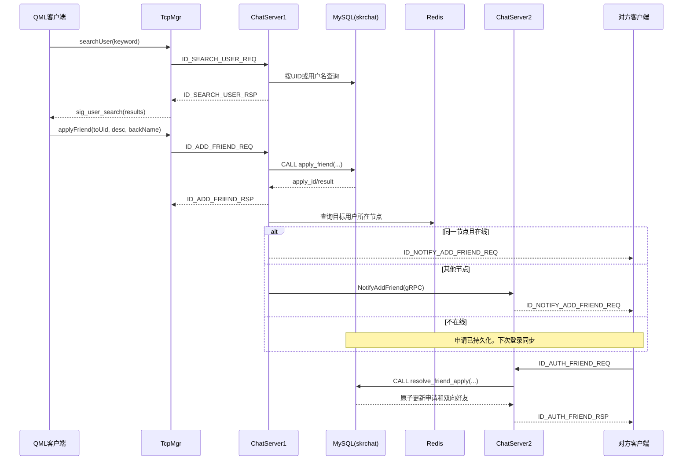

# 好友查询与申请：C++/QML 适配教程

> 修订版：2026-09-08
>
> 核对基线：客户端 7fc7faf、服务端 40950c6。本文区分“现有代码”和“目标实现”，没有进行构建或测试。首先阅读 [好友功能当前状态与代码导航](FRIEND_FEATURE_STATUS.md)：ChatServer1 缺少 AddFriendApply 定义，两个跨节点审核 RPC 客户端仍为空，不能把本教程视为全部功能已经验收通过的证明。
>
> 本次修订以当前仓库的真实类型和函数签名为准。最重要的修复是：**客户端继续使用现有 `ReqId`，服务端使用现有 `MSG_IDS`；两端只要求线上数值一致，不要求 C++ 枚举类型同名。**
>
> 文中的 Markdown 围栏（` ```cpp `、` ```qml `、` ``` `）只用于排版，复制代码时不要把反引号复制进源文件。

## 1. 教程目标

本文把原 Qt Widgets 教程中的好友查询、好友申请、跨 ChatServer 通知、申请列表和好友认证流程，改写为适用于当前 SakuraChat 项目的 **Qt 6 + C++ + QML** 实现方案。

完成后应具备以下能力：

1. 用户在 `ChatDialog.qml` 中输入 UID 或用户名查询用户。
2. 查询期间由 QML 显示加载状态，服务器返回后展示用户资料或空结果。
3. 用户通过 QML 弹窗填写验证消息并发起好友申请。
4. ChatServer 将申请持久化到 `skrchat.friend_apply`。
5. 接收者在线时获得实时通知；不在线时，下次登录仍能加载申请。
6. 接收者同意或拒绝申请；同意时数据库原子建立双向好友关系。
7. 多个 ChatServer 之间通过 gRPC 转发实时通知。

> 本文是针对当前代码基线的实施教程，不代表这些功能现在已经全部完成。代码块分为两类：标为“完整替换/完整实现”的可以按对应范围使用；标为“核心逻辑”的还必须同时完成该小节列出的声明、头文件和调用方修改，不能只复制函数体。

## 2. 从 Qt Widgets 到 QML 的对应关系

| 原 Widgets 方案 | 当前项目的 QML 方案 |
| --- | --- |
| `SearchList : QListWidget` | `ChatDialog.qml` 中的 `ListView + ListModel` |
| `QListWidgetItem` 和 `itemWidget()` | QML delegate，通过 `model.uid` 等角色访问数据 |
| `FindSuccessDlg : QDialog` | `FindSuccessDialog.qml` |
| `ApplyFriend : QDialog` | `ApplyFriend.qml : Popup` |
| `AuthenFriend : QDialog` | 新增 `ReviewFriendApplication.qml : Dialog` |
| `LoadingDlg` | `BusyIndicator` 和半透明 `Rectangle` |
| QWidget 信号槽连接 | QML `Connections`、QML signal 和 `Q_INVOKABLE` |
| 手动 `new/deleteLater` | QML 声明式组件和 `open()/close()` |
| `ApplyFriendPage::AddNewApply()` | `ApplyFriendList : QAbstractListModel` 的 `upsertItem()` |
| QWidget 红点控件 | QML 属性绑定：`visible: pendingApplyCount > 0` |

核心原则是：

- QML 负责页面、交互和状态呈现。
- C++ `TcpMgr` 负责协议封包、网络收发和 JSON 转换。
- `QAbstractListModel` 负责页面申请列表；当前 Model 随页面生命周期存在，TcpMgr 保存最近登录快照，不等于完整的实时状态仓库。
- ChatServer 负责身份校验、业务编排、数据库和跨节点通知。
- 客户端不能决定申请人 UID，服务端必须从已认证的 `CSession` 获取。

## 3. 当前项目基线

本功能会涉及以下现有文件：

```text
SakuraChat/
├─ main.cpp
├─ src/
│  ├─ global.h
│  ├─ tcpmgr.h/.cpp
│  ├─ usermgr.h/.cpp
│  ├─ applyfriendmodel.h/.cpp
│  └─ applyfriendlist.h/.cpp
└─ qml/
   ├─ ChatDialog.qml
   ├─ FindSuccessDialog.qml
   ├─ ApplyFriend.qml
   ├─ ApplyFriendPage.qml
   └─ ApplyFriendItem.qml

Server/
├─ Common/
│  ├─ include/const.h
│  ├─ include/data.h
│  ├─ include/MysqlDao.h
│  ├─ src/MysqlDao.cpp
│  └─ message.proto
├─ ChatServer1/
└─ ChatServer2/

database/schema.sql
```

以下是实施教程之前的历史缺口，不是 2026-09-08 的实时完成度。其中搜索、申请页和审核 UI 已有改动；具体状态以本教程开头链接的现状表为准。若某项已经完成，不要重复定义：

- 客户端最初的 `ReqId` 只定义到 `ID_CHAT_LOGIN_RSP`；修订后的目标状态是继续扩展这个 `ReqId`，而不是新增第二个消息枚举。
- `TcpMgr::initHandlers()` 最初只处理聊天服务器登录回包。
- `ChatDialog.qml` 搜索定时器目前只打印日志，没有发请求。
- `FindSuccessDialog.qml` 声明的是 `userId/userName`，但 `ChatDialog.qml` 赋值的是 `targetUid/targetName`。
- `FindSuccessDialog.qml` 的按钮仍显示“发送消息”，不是“添加好友”。
- `ApplyFriendModel::confirmApply()` 只打印日志。
- `ApplyFriendPage.qml` 使用的是演示数据。
- `ApplyFriend.qml` 使用了项目中不存在的 `TgButton`，应改成现有 `CommonButton`。
- `ChatServer1/2::LogicSystem` 尚未注册好友相关回调。
- `ChatGrpcClient` 和 `ChatServiceImpl` 中的好友方法仍是空实现。
- `MysqlMgr::GetUser(std::string)` 当前提前 `return nullptr`，按用户名查询永远失败。
- `MysqlDao::GetUser()` 尚未完整读取 `nick/desc/gender/icon`。

## 4. 完整调用链



## 5. 第一步：统一请求 ID

### 5.1 先理解“相同”的含义

TCP 线上传输的是 16 位整数消息 ID，因此客户端和服务端必须使用相同数值。但是二者属于不同的可执行程序，**不需要使用同名 C++ 枚举**。

当前客户端的 `TcpMgr` 接口是：

```cpp
void handleMsg(ReqId id, int len, const QByteArray &data);
QMap<ReqId, std::function<void(ReqId, int, const QByteArray &)>> _handlers;
void slot_send_data(ReqId id, QString data);
```

所以客户端所有消息常量都必须属于 `ReqId`。如果另外创建 `MSG_IDS`，即使两个成员的数值都是 `1007`，`MSG_IDS` 也不能自动转换成 `ReqId`，会出现：

```text
Cannot initialize a parameter of type 'ReqId'
No matching member function for call to 'insert'
```

### 5.2 客户端：只扩展现有 ReqId

在 `SakuraChat/src/global.h` 中保留一个消息枚举，目标状态如下：

```cpp
enum ReqId {
    ID_GET_VARIFY_CODE = 1001,
    ID_REG_USER = 1002,
    ID_RESET_PWD = 1003,
    ID_LOGIN_USER = 1004,
    ID_CHAT_LOGIN = 1005,
    ID_CHAT_LOGIN_RSP = 1006,
    ID_SEARCH_USER_REQ = 1007,
    ID_SEARCH_USER_RSP = 1008,
    ID_ADD_FRIEND_REQ = 1009,
    ID_ADD_FRIEND_RSP = 1010,
    ID_NOTIFY_ADD_FRIEND_REQ = 1011,
    ID_AUTH_FRIEND_REQ = 1012,
    ID_AUTH_FRIEND_RSP = 1013,
    ID_NOTIFY_AUTH_FRIEND_REQ = 1014
};
```

客户端不要再定义第二个 `enum MSG_IDS`，也不要在每次调用处使用 `static_cast<ReqId>` 掩盖类型设计错误。

### 5.3 服务端：扩展现有 MSG_IDS

在 `Server/Common/include/const.h` 中扩展服务端原有的 `MSG_IDS`：

```cpp
enum MSG_IDS {
    MSG_CHAT_LOGIN = 1005,
    MSG_CHAT_LOGIN_RSP = 1006,
    ID_SEARCH_USER_REQ = 1007,
    ID_SEARCH_USER_RSP = 1008,
    ID_ADD_FRIEND_REQ = 1009,
    ID_ADD_FRIEND_RSP = 1010,
    ID_NOTIFY_ADD_FRIEND_REQ = 1011,
    ID_AUTH_FRIEND_REQ = 1012,
    ID_AUTH_FRIEND_RSP = 1013,
    ID_NOTIFY_AUTH_FRIEND_REQ = 1014
};
```

这里客户端叫 `ReqId`、服务端叫 `MSG_IDS` 没有问题。需要保持一致的是 `1005～1014` 的协议数值。以后可以再把协议 ID 抽成不依赖 Qt/Boost 的共享头文件，但本功能不以此为前置条件。

建议的 TCP JSON 数据如下：

| 消息 | 请求/响应字段 |
| --- | --- |
| 搜索请求 | `keyword` |
| 搜索响应 | `error`、`found`、`uid`、`name`、`nick`、`desc`、`gender`、`icon`、`is_friend` |
| 申请请求 | `touid`、`descs`、`back_name` |
| 申请响应 | `error`、`result`、`apply_id` |
| 申请通知 | `apply_id`、`applyuid`、`name`、`nick`、`desc`、`gender`、`icon`、`message` |
| 审核请求 | `apply_id`、`agree` |
| 审核响应 | `error`、`result`、`apply_id`、`agree` |
| 审核通知 | `error`、`result`、`apply_id`、`agree`、`peer_uid` |

不要从客户端请求体读取 `fromuid` 或 `uid` 作为申请人身份。登录成功后，服务器已经通过 `session->SetUserId(uid)` 记录了认证身份，业务处理应使用：

```cpp
const int fromUid = session->GetUserId();
```

## 6. 第二步：完善客户端 C++/QML 桥接

### 6.1 为 UserMgr 增加只读接口

如果其他客户端 C++ 逻辑需要当前 UID，可在 `usermgr.h` 增加：

```cpp
int GetUid() const { return _uid; }
QString GetName() const { return _name; }
```

QML 不必直接访问 `UserMgr`；搜索和申请统一经由 `TcpMgr`，减少页面对全局状态的依赖。

### 6.2 扩展 TcpMgr 公共接口

`tcpmgr.h` 至少要直接包含它自己使用的类型，不能依赖其他头文件间接包含：

```cpp
#include <QJsonObject>
#include <QMap>
#include <QVariant>
#include <functional>
```

然后增加以下 QML 接口和状态。这里仍然统一使用 `ReqId`：

```cpp
Q_PROPERTY(bool searchPending READ searchPending NOTIFY searchPendingChanged)
Q_PROPERTY(bool applyPending READ applyPending NOTIFY applyPendingChanged)
Q_PROPERTY(bool reviewPending READ reviewPending NOTIFY reviewPendingChanged)
Q_PROPERTY(QVariantList friendApplySnapshot
           READ friendApplySnapshot
           NOTIFY friendApplySnapshotChanged)

public:
    bool searchPending() const { return _searchPending; }
    bool applyPending() const { return _applyPending; }
    bool reviewPending() const { return _reviewPending; }
    QVariantList friendApplySnapshot() const {
        return _friendApplySnapshot;
    }

    Q_INVOKABLE void searchUser(const QString &keyword);
    Q_INVOKABLE void applyFriend(int toUid,
                                 const QString &descs,
                                 const QString &backName);
    Q_INVOKABLE void resolveFriendApply(qint64 applyId, bool agree);

signals:
    void searchPendingChanged();
    void applyPendingChanged();
    void reviewPendingChanged();
    void friendApplySnapshotChanged();
    void sig_user_search(QVariantList results);
    void sig_search_failed(int error, QString message);
    void sig_friend_apply_result(int error, int result, qint64 applyId);
    void sig_friend_apply(QVariantMap application);
    void sig_friend_apply_resolved(int error, int result,
                                   qint64 applyId, bool agree);
    void sig_friend_auth_notified(qint64 applyId, bool agree, int peerUid);

private:
    void sendJson(ReqId id, const QJsonObject &object);
    void resetBusinessPending();
    bool _searchPending = false;
    bool _applyPending = false;
    bool _reviewPending = false;
    QVariantList _friendApplySnapshot;
```

当前 `main.cpp` 已把 `TcpMgr` 暴露为 `tcpMgr`：

```cpp
engine.rootContext()->setContextProperty(
    "tcpMgr", TcpMgr::GetInstance().get());
```

因此本文统一在 QML 中使用小写的 `tcpMgr`。不要一部分页面使用 `TcpMgr`，另一部分使用 `tcpMgr`。

### 6.3 实现 QML 调用方法

在 `tcpmgr.cpp` 中增加：

```cpp
void TcpMgr::sendJson(ReqId id, const QJsonObject &object)
{
    slot_send_data(id,
        QString::fromUtf8(QJsonDocument(object).toJson(QJsonDocument::Compact)));
}

void TcpMgr::searchUser(const QString &keyword)
{
    const QString value = keyword.trimmed();
    if (value.isEmpty() || _searchPending)
        return;

    _searchPending = true;
    emit searchPendingChanged();
    sendJson(ID_SEARCH_USER_REQ, {{"keyword", value}});
}

void TcpMgr::applyFriend(int toUid,
                         const QString &descs,
                         const QString &backName)
{
    if (toUid <= 0 || _applyPending)
        return;

    _applyPending = true;
    emit applyPendingChanged();
    sendJson(ID_ADD_FRIEND_REQ, {
        {"touid", toUid},
        {"descs", descs.trimmed()},
        {"back_name", backName.trimmed()}
    });
}

void TcpMgr::resolveFriendApply(qint64 applyId, bool agree)
{
    if (applyId <= 0 || _reviewPending)
        return;

    _reviewPending = true;
    emit reviewPendingChanged();
    sendJson(ID_AUTH_FRIEND_REQ, {
        {"apply_id", applyId},
        {"agree", agree}
    });
}

void TcpMgr::resetBusinessPending()
{
    if (_searchPending) {
        _searchPending = false;
        emit searchPendingChanged();
    }
    if (_applyPending) {
        _applyPending = false;
        emit applyPendingChanged();
    }
    if (_reviewPending) {
        _reviewPending = false;
        emit reviewPendingChanged();
    }
}
```

在 `_socket.errorOccurred` 和 `_socket.disconnected` 的现有连接回调中调用 `resetBusinessPending()`。每个响应处理器也应先复位自己的 pending 状态。这样网络失败时 QML 遮罩不会永久存在。

### 6.4 注册完整回包和通知处理器

在 `TcpMgr::initHandlers()` 中注册：

```cpp
_handlers.insert(ID_SEARCH_USER_RSP,
    [this](ReqId, int, const QByteArray &data) {
        _searchPending = false;
        emit searchPendingChanged();

        const auto doc = QJsonDocument::fromJson(data);
        if (!doc.isObject()) {
            emit sig_search_failed(ErrorCodes::ERR_JSON, "响应格式错误");
            return;
        }

        const QJsonObject root = doc.object();
        if (root["error"].toInt(-1) != ErrorCodes::SUCCESS) {
            emit sig_search_failed(root["error"].toInt(), "查询失败");
            return;
        }

        QVariantList results;
        if (root["found"].toBool(false)) {
            QVariantMap user;
            user["uid"] = root["uid"].toInt();
            user["name"] = root["name"].toString();
            user["nick"] = root["nick"].toString();
            user["desc"] = root["desc"].toString();
            user["gender"] = root["gender"].toInt();
            user["icon"] = root["icon"].toString();
            user["isFriend"] = root["is_friend"].toBool(false);
            results.append(user);
        }
        emit sig_user_search(results);
    });

_handlers.insert(ID_ADD_FRIEND_RSP,
    [this](ReqId, int, const QByteArray &data) {
        _applyPending = false;
        emit applyPendingChanged();

        const auto doc = QJsonDocument::fromJson(data);
        if (!doc.isObject()) {
            emit sig_friend_apply_result(ErrorCodes::ERR_JSON, -1, 0);
            return;
        }

        const auto root = doc.object();
        emit sig_friend_apply_result(
            root["error"].toInt(-1),
            root["result"].toInt(-1),
            root["apply_id"].toVariant().toLongLong());
    });

_handlers.insert(ID_NOTIFY_ADD_FRIEND_REQ,
    [this](ReqId, int, const QByteArray &data) {
        const auto root = QJsonDocument::fromJson(data).object();
        if (root["error"].toInt(-1) != ErrorCodes::SUCCESS)
            return;

        QVariantMap item;
        item["applyId"] = root["apply_id"].toVariant().toLongLong();
        item["uid"] = root["applyuid"].toInt();
        item["name"] = root["name"].toString();
        item["head"] = root["icon"].toString();
        item["message"] = root["message"].toString();
         item["status"] = 0;
         emit sig_friend_apply(item);
     });

_handlers.insert(ID_AUTH_FRIEND_RSP,
    [this](ReqId, int, const QByteArray &data) {
        _reviewPending = false;
        emit reviewPendingChanged();

        const auto doc = QJsonDocument::fromJson(data);
        if (!doc.isObject()) {
            emit sig_friend_apply_resolved(
                ErrorCodes::ERR_JSON, -1, 0, false);
            return;
        }

        const auto root = doc.object();
        emit sig_friend_apply_resolved(
            root["error"].toInt(-1),
            root["result"].toInt(-1),
            root["apply_id"].toVariant().toLongLong(),
            root["agree"].toBool(false));
    });

_handlers.insert(ID_NOTIFY_AUTH_FRIEND_REQ,
    [this](ReqId, int, const QByteArray &data) {
        const auto doc = QJsonDocument::fromJson(data);
        if (!doc.isObject())
            return;

        const auto root = doc.object();
        if (root["error"].toInt(-1) != ErrorCodes::SUCCESS ||
            root["result"].toInt(-1) != 0) {
            return;
        }

        emit sig_friend_auth_notified(
            root["apply_id"].toVariant().toLongLong(),
            root["agree"].toBool(false),
            root["peer_uid"].toInt());
    });
```

`QVariantMap/QVariantList` 可以直接被 QML 使用，不需要把 `std::shared_ptr<SearchInfo>` 注册为 QML 元类型，也避免 QML 持有 C++ 智能指针。

### 6.5 登录回包中的离线申请快照

位置：SakuraChat/src/tcpmgr.cpp → TcpMgr::initHandlers() → 现有 ID_CHAT_LOGIN_RSP lambda 内。第 13 节让服务端增加 apply_list；在 error 检查成功、UserMgr 的 SetName/SetUid/SetToken 调用之后、emit sig_switch_chatlg() 之前加入以下代码。不要另外注册第二个登录处理器：

```cpp
QVariantList applications;
const auto array = jsonObj["apply_list"].toArray();
for (const auto &value : array) {
    const auto source = value.toObject();
    QVariantMap item;
    item["applyId"] = source["apply_id"].toVariant().toLongLong();
    item["uid"] = source["uid"].toInt();
    item["name"] = source["name"].toString();
    item["head"] = source["icon"].toString();
    item["message"] = source["message"].toString();
    item["status"] = source["status"].toInt();
    applications.append(item);
}
_friendApplySnapshot = applications;
emit friendApplySnapshotChanged();
```

同时在 `tcpmgr.cpp` 中包含 `<QJsonArray>`。这里把快照保存在 `TcpMgr` 属性中，而不只是发出一次性信号，因为登录回包到达时 `ChatDialog.qml` 可能尚未创建；只有信号会导致新页面错过数据。登录快照和实时通知最终都进入同一个 `ApplyFriendList`，由 Model 按 `applyId` 去重。

## 7. 第三步：改造用户搜索 QML

### 7.1 发起搜索

将 `ChatDialog.qml` 中搜索定时器的日志替换为真实调用：

```qml
Timer {
    id: searchDebounceTimer
    interval: 300
    repeat: false

    onTriggered: {
        if (searchInput.text.trim().length > 0)
            tcpMgr.searchUser(searchInput.text)
    }
}
```

搜索框保留现有逻辑：有文本时显示 `searchPanel` 并重启防抖定时器；清空时隐藏面板并清空模型。

### 7.2 接收搜索结果

位置：SakuraChat/qml/ChatDialog.qml 根 Rectangle（id: chatDialog）中，与 searchResultModel、searchDebounceTimer 同级。如果已有 target: tcpMgr 的 Connections，就合并处理函数；不要重复声明同名处理器，也不要在 Component.onCompleted 手工 connect。

在根对象声明错误状态：

```qml
property string searchError: ""
```

Connections 使用根属性，而不是跨 Component 访问内部 Text 的 id：

```qml
Connections {
    target: tcpMgr

    function onSig_user_search(results) {
        chatDialog.searchError = ""
        searchResultModel.clear()
        for (let i = 0; i < results.length; ++i)
            searchResultModel.append(results[i])
    }

    function onSig_search_failed(error, message) {
        searchResultModel.clear()
        chatDialog.searchError = message + "（" + error + "）"
    }
}
```

搜索列表 footer 内现有空状态 Text 的 text 属性改为绑定根状态；不要从外层引用 footer Component 中的 searchErrorText：

```qml
text: chatDialog.searchError.length > 0
      ? chatDialog.searchError
      : "未找到相关用户"
```

搜索遮罩放在 searchPanel 内，与结果 ListView 同级，并绑定 C++ 搜索状态：

```qml
Rectangle {
    anchors.fill: parent
    z: 10
    visible: tcpMgr.searchPending
    color: "#80ffffff"

    BusyIndicator {
        anchors.centerIn: parent
        running: parent.visible
    }
}
```

仅替换搜索区域遮罩的 chatModel.isLoading() 绑定；聊天列表分页遮罩仍使用聊天分页状态。

### 7.3 修复搜索结果弹窗属性

当前 `FindSuccessDialog.qml` 对外属性是：

```qml
property string userId: ""
property string userName: "未知用户"
property string avatarSource: "qrc:/res/SakuraChat.png"
property bool isFriend: false
```

位置：SakuraChat/qml/ChatDialog.qml 中 searchResultModel 对应 ListView 的 delegate 点击处理器；替换该处 onClicked，而不是改聊天联系人 delegate。因此搜索 delegate 点击时应写成：

```qml
onClicked: {
    findSuccessDialog.userId = String(model.uid)
    findSuccessDialog.userName = model.name
    findSuccessDialog.avatarSource = model.icon || "qrc:/res/SakuraChat.png"
    findSuccessDialog.isFriend = model.isFriend
    findSuccessDialog.open()
}
```

不要继续给实例上临时声明的 `targetUid/targetName` 赋值，因为弹窗内部真正显示的是 `userId/userName`。同时删除搜索列表 header 中“把输入文本直接当成 UID 并打开弹窗”的演示逻辑；只有服务器返回的搜索结果才能进入申请流程。

### 7.4 从资料弹窗打开申请弹窗

为 `FindSuccessDialog.qml` 增加信号：

```qml
signal applyRequested(int uid, string name, string avatar)
```

把按钮文字从“发送消息”改为“添加好友”。已是好友时禁用按钮：

```qml
text: root.isFriend ? "已是好友" : "添加好友"
enabled: !root.isFriend && Number(root.userId) > 0

onClicked: {
    root.applyRequested(Number(root.userId), root.userName, root.avatarSource)
    root.close()
}
```

位置：ChatDialog.qml 根 Rectangle 中，与 Connections、页面布局同级。FindSuccessDialog.qml 的 signal 加在根 Dialog 内，按钮逻辑替换原按钮的 text/enabled/onClicked。下面两个实例若已存在就修改原实例，不要重复声明相同 id：

```qml
ApplyFriend {
    id: applyFriendPopup

    onSubmitted: function(toUid, descs, backName) {
        tcpMgr.applyFriend(toUid, descs, backName)
    }
}

FindSuccessDialog {
    id: findSuccessDialog

    onApplyRequested: function(uid, name, avatar) {
        applyFriendPopup.targetUid = uid
        applyFriendPopup.targetName = name
        applyFriendPopup.targetAvatar = avatar
        applyFriendPopup.open()
    }
}
```

处理申请结果时使用第 6 节修订后的三个参数，不要只看业务 `result` 而忽略传输/解析错误：

```qml
Connections {
    target: tcpMgr

    function onSig_friend_apply_result(error, result, applyId) {
        if (error !== 0) {
            console.warn("好友申请请求失败：", error)
        } else if (result === 0) {
            console.log("好友申请已保存，applyId =", applyId)
        } else if (result === 1) {
            console.log("双方已经是好友")
        } else {
            console.warn("好友申请被拒绝：", result)
        }
    }
}
```

## 8. 第四步：改造 ApplyFriend.qml

为 `ApplyFriend.qml` 增加目标用户属性和提交信号：

```qml
property int targetUid: 0
property string targetName: ""
property string targetAvatar: ""
signal submitted(int toUid, string descs, string backName)
```

验证消息使用已有 `ApplyFriendModel.applyMessage`。`back_name` 是申请方为未来好友设置的备注，不是标签，因此增加一个明确的备注输入框：

```qml
TextField {
    id: backNameField
    Layout.fillWidth: true
    placeholderText: root.targetName
    maximumLength: 64
}
```

底部按钮应使用项目已有的 `CommonButton`，而不是不存在的 `TgButton`：

```qml
CommonButton {
    text: "取消"
    style: "secondary"
    Layout.fillWidth: true
    onClicked: root.close()
}

CommonButton {
    text: "确认"
    style: "primary"
    Layout.fillWidth: true
    enabled: root.targetUid > 0 && !tcpMgr.applyPending

    onClicked: {
        const backName = backNameField.text.trim().length > 0
                       ? backNameField.text.trim()
                       : root.targetName
        root.submitted(root.targetUid, model.applyMessage, backName)
        // 请求发出后可以关闭弹窗；最终成功与否以服务器回包为准。
        root.close()
    }
}
```

当前标签 UI 可以保留为“仅本地演示”，但现有数据库没有好友标签表。本阶段不要调用 `initDemoTags()` 后让用户误以为标签已经持久化；正式流程建议先隐藏 `TagInputBar/TagGrid`。若确实需要标签，应后续增加 `friend_tag` 和 `friend_tag_relation` 表及对应接口。

## 9. 第五步：实现 ChatServer 用户查询

### 9.1 注册回调

`ChatServer1` 和 `ChatServer2` 必须做相同修改。在两个 `LogicSystem.h` 中声明：

```cpp
void SearchInfo(std::shared_ptr<CSession>, const short &, const std::string &);
void AddFriendApply(std::shared_ptr<CSession>, const short &, const std::string &);
void ResolveFriendApply(std::shared_ptr<CSession>, const short &, const std::string &);
void NotifyFriendApplication(int fromUid, int toUid, std::int64_t applyId,
                             const std::string &descs);
void NotifyFriendResolution(int applicantUid, int actorUid,
                            std::int64_t applyId, bool agree);
```

头文件还需要包含 `<cstdint>`。然后在两个 `LogicSystem.cpp` 的 `RegisterCallBacks()` 中增加：

```cpp
_fun_callbacks[ID_SEARCH_USER_REQ] =
    std::bind(&LogicSystem::SearchInfo, this,
              std::placeholders::_1,
              std::placeholders::_2,
              std::placeholders::_3);

_fun_callbacks[ID_ADD_FRIEND_REQ] =
    std::bind(&LogicSystem::AddFriendApply, this,
              std::placeholders::_1,
              std::placeholders::_2,
              std::placeholders::_3);

_fun_callbacks[ID_AUTH_FRIEND_REQ] =
    std::bind(&LogicSystem::ResolveFriendApply, this,
              std::placeholders::_1,
              std::placeholders::_2,
              std::placeholders::_3);
```

不要只修改一个 ChatServer；StatusServer 可能把不同用户分配到不同节点。

### 9.2 查询处理

```cpp
void LogicSystem::SearchInfo(std::shared_ptr<CSession> session,
                             const short &,
                             const std::string &msgData)
{
    Json::Value request;
    Json::Value response;
    Json::Reader reader;

    Defer reply([&] {
        session->Send(response.toStyledString(), ID_SEARCH_USER_RSP);
    });

    if (!reader.parse(msgData, request) ||
        !request.isMember("keyword") ||
        !request["keyword"].isString()) {
        response["error"] = ErrorCodes::Error_Json;
        return;
    }

    const std::string keyword = request["keyword"].asString();
    if (keyword.empty() || keyword.size() > 64) {
        response["error"] = ErrorCodes::Error_Json;
        return;
    }

    std::shared_ptr<UserInfo> user;

    const bool digits = !keyword.empty() &&
        std::all_of(keyword.begin(), keyword.end(),
                    [](unsigned char c) { return std::isdigit(c); });

    if (digits) {
        int uid = 0;
        const auto result = std::from_chars(
            keyword.data(), keyword.data() + keyword.size(), uid);
        if (result.ec != std::errc{} ||
            result.ptr != keyword.data() + keyword.size()) {
            response["error"] = ErrorCodes::UidInvalid;
            return;
        }
        user = MysqlMgr::GetInstance()->GetUser(uid);
    } else {
        user = MysqlMgr::GetInstance()->GetUser(keyword);
    }

    response["error"] = ErrorCodes::Success;
    response["found"] = user != nullptr;
    if (!user)
        return;

    // 只返回公开资料，绝不能把 pwd、email、token 发给搜索者。
    response["uid"] = user->uid;
    response["name"] = user->name;
    response["nick"] = user->nick;
    response["desc"] = user->desc;
    response["gender"] = user->gender;
    response["icon"] = user->icon;
    response["is_friend"] =
        session->GetUserId() != user->uid &&
        MysqlMgr::GetInstance()->FriendExists(session->GetUserId(), user->uid);
}
```

`LogicSystem.cpp` 为这段代码直接包含 `<algorithm>`、`<charconv>`、`<cctype>` 和 `<system_error>`。使用 `std::from_chars` 是为了避免超长数字触发 `std::stoi` 异常。用户名查询保持精确匹配；频率限制属于上线前增强项。

### 9.3 修复 DAO 查询字段

`ChatServer1/src/MysqlMgr.cpp` 和 `ChatServer2/src/MysqlMgr.cpp` 的 `GetUser(std::string name)` 都要删除当前提前返回：

```cpp
std::shared_ptr<UserInfo> MysqlMgr::GetUser(std::string name)
{
    return _dao.GetUser(std::move(name));
}
```

两个 `MysqlDao::GetUser` 都使用明确字段，而不是 `SELECT *`，并过滤已停用用户：

```sql
SELECT uid, name, email, nick, `desc`, gender, icon
FROM user
WHERE uid = ? AND status = 0
```

按用户名查询时只把条件换成：

```sql
WHERE name = ? AND status = 0
```

查询成功后完整填充：

```cpp
user->uid = res->getInt("uid");
user->name = res->getString("name");
user->email = res->getString("email");
user->nick = res->getString("nick");
user->desc = res->getString("desc");
user->gender = res->getInt("gender");
user->icon = res->getString("icon");
```

新版数据库字段是 `gender`，不再使用原教程里的 `sex`。

为搜索结果计算好友状态，在 `MysqlDao.h`、两个 `MysqlMgr.h` 中增加：

```cpp
bool FriendExists(int selfUid, int friendUid);
```

`MysqlMgr` 只负责转发给 `_dao`。DAO 查询使用：

```sql
SELECT 1
FROM friend
WHERE self_uid = ? AND friend_uid = ?
LIMIT 1
```

## 10. 第六步：好友申请持久化

2026-09-08 基线提示：共享 DAO 与两个 MysqlMgr 转发存在；下面的 LogicSystem::AddFriendApply 只有 ChatServer2 定义，ChatServer1 仍缺失。按本节将处理器完整定义补到 ChatServer1/src/LogicSystem.cpp 的类外，不能仅有 .h 声明或 RegisterCallBacks 注册。本次只补文档说明，没有替你修改该代码。

当前 `database/schema.sql` 已提供：

```sql
CALL apply_friend(from_uid, to_uid, descs, back_name, @result);
```

其结果约定：

- `0`：成功创建或重新发起申请。
- `1`：双方已经是好友。
- `-1`：参数、用户状态或数据库异常。

为了给客户端返回 `apply_id`，调用过程后再按唯一键查询申请 ID。在 `Server/Common/include/data.h` 增加：

```cpp
struct FriendApplyResult {
    int result = -1;
    std::int64_t applyId = 0;
};
```

在 `MysqlDao.h` 以及两个 ChatServer 的 `MysqlMgr.h` 增加：

```cpp
FriendApplyResult AddFriendApply(int fromUid,
                                 int toUid,
                                 const std::string &descs,
                                 const std::string &backName);
```

两个 `MysqlMgr.cpp` 的实现都只转发给 `_dao`，不要各自复制 SQL。

DAO 核心流程：

```cpp
FriendApplyResult MysqlDao::AddFriendApply(
    int fromUid, int toUid,
    const std::string &descs,
    const std::string &backName)
{
    FriendApplyResult output;
    auto con = _pool->getConnection();
    if (!con)
        return output;

    Defer giveBack([this, &con] {
        _pool->returnConnection(std::move(con));
    });

    try {
        {
            auto call = std::unique_ptr<sql::PreparedStatement>(
                con->_con->prepareStatement(
                    "CALL apply_friend(?,?,?,?,@result)"));
            call->setInt(1, fromUid);
            call->setInt(2, toUid);
            call->setString(3, descs);
            call->setString(4, backName);
            call->execute();
        }

        auto resultStmt = std::unique_ptr<sql::PreparedStatement>(
            con->_con->prepareStatement(
                "SELECT @result AS result, "
                "COALESCE((SELECT id FROM friend_apply "
                "WHERE from_uid=? AND to_uid=?), 0) AS apply_id"));
        resultStmt->setInt(1, fromUid);
        resultStmt->setInt(2, toUid);

        auto resultSet = std::unique_ptr<sql::ResultSet>(
            resultStmt->executeQuery());
        if (resultSet->next()) {
            output.result = resultSet->getInt("result");
            output.applyId = static_cast<std::int64_t>(
                resultSet->getUInt64("apply_id"));
        }
    } catch (const sql::SQLException &e) {
        std::cerr << "AddFriendApply failed, code="
                  << e.getErrorCode() << std::endl;
    }
    return output;
}
```

连接通过现有 `Defer` 归还连接池。异常时保留 `result=-1`，只记录错误码，不把 SQL 文本直接返回客户端。若你的 Connector/C++ 版本没有 `getUInt64()`，使用该版本对应的 64 位整数读取接口，但不要降成 32 位 `getInt()`。

服务端处理申请时：

```cpp
void LogicSystem::AddFriendApply(std::shared_ptr<CSession> session,
                                 const short &,
                                 const std::string &msgData)
{
    Json::Value request;
    Json::Value response;
    Json::Reader reader;

    Defer reply([&] {
        session->Send(response.toStyledString(), ID_ADD_FRIEND_RSP);
    });

    if (!reader.parse(msgData, request) ||
        !request["touid"].isInt() ||
        !request["descs"].isString() ||
        !request["back_name"].isString()) {
        response["error"] = ErrorCodes::Error_Json;
        response["result"] = -1;
        response["apply_id"] = Json::Int64(0);
        return;
    }

    const int fromUid = session->GetUserId();
    const int toUid = request["touid"].asInt();
    const std::string descs = request["descs"].asString();
    const std::string backName = request["back_name"].asString();

    if (fromUid <= 0 || toUid <= 0 || fromUid == toUid ||
        descs.size() > 255 || backName.size() > 64) {
        response["error"] = ErrorCodes::UidInvalid;
        response["result"] = -1;
        response["apply_id"] = Json::Int64(0);
        return;
    }

    const auto dbResult = MysqlMgr::GetInstance()->AddFriendApply(
        fromUid, toUid, descs, backName);

    response["error"] = ErrorCodes::Success;
    response["result"] = dbResult.result;
    response["apply_id"] = Json::Int64(dbResult.applyId);

    if (dbResult.result != 0)
        return;

    // 数据库成功后再执行在线通知；通知失败不回滚申请。
    NotifyFriendApplication(fromUid, toUid, dbResult.applyId, descs);
}
```

这里的长度检查按 UTF-8 字节数保守限制；若要完整支持数据库定义中的 255 个 Unicode 字符，应增加统一的 UTF-8 字符计数工具，不能直接把字节数当字符数。

持久化是事实来源，实时通知只是优化。因此对方不在线、Redis 没有路由、gRPC 暂时失败时，也不应删除已经成功写入数据库的申请。

## 11. 第七步：跨 ChatServer 实时通知

### 11.1 统一 proto

按现有工程，以完整的 Server/VarifyServer/message.proto 维护协议；VarifyServer/proto.js 运行时也读取它。旧 Common/message.proto 缺少完整 ChatService，不能直接拿它重新生成并覆盖当前生成文件。本教程不要求迁移协议目录或删除副本。CMake 实际编译的是 Common/src/message*.cc，并公开 Common/include/message*.h；协议源位置与生成文件位置是两回事。

在 VarifyServer/message.proto 的现有消息定义中核对以下字段；当前已经包含，勿重复添加。扩展只增加字段，不复用旧字段编号：

```proto
message AddFriendReq {
  int32 applyuid = 1;
  string name = 2;
  string desc = 3;
  int32 touid = 4;
  int64 apply_id = 5;
  string icon = 6;
  string nick = 7;
  int32 gender = 8;
}

message AuthFriendReq {
  int32 fromuid = 1;  // 保留已有字段编号
  int32 touid = 2;    // 保留已有字段编号
  int64 apply_id = 3;
  bool agree = 4;
}
```

不要改变已经发布字段的编号或类型。修改 proto 后必须使用与项目 gRPC/Protobuf 库匹配的 `protoc` 和 `grpc_cpp_plugin` 重新生成文件，并放到 CMake 当前使用的位置：

```text
Server/Common/include/message.pb.h
Server/Common/include/message.grpc.pb.h
Server/Common/src/message.pb.cc
Server/Common/src/message.grpc.pb.cc
```

不能只改 .proto，也不能只替换头文件或只替换 .cc。GateServer、StatusServer 和两个 ChatServer 通过 Common 链接同一套生成代码。现有 VarifyServer/start.bat 使用当前工作目录且只输出到该目录：应从 VarifyServer 运行，生成后同步上述四个文件，并核对 include 路径。脚本不会自动同步 Common；不要删除 Common 中构建仍依赖的生成文件。

### 11.2 路由目标用户

申请保存成功后，根据登录时写入的 Redis 路由 `_uip<uid>` 判断目标节点。第 9.1 节声明过的帮助函数完整逻辑如下：

```cpp
void LogicSystem::NotifyFriendApplication(
    int fromUid, int toUid, std::int64_t applyId,
    const std::string &descs)
{
    const auto applicant = MysqlMgr::GetInstance()->GetUser(fromUid);
    if (!applicant)
        return;

    Json::Value notify;
    notify["error"] = ErrorCodes::Success;
    notify["apply_id"] = Json::Int64(applyId);
    notify["applyuid"] = fromUid;
    notify["name"] = applicant->name;
    notify["nick"] = applicant->nick;
    notify["desc"] = applicant->desc;
    notify["icon"] = applicant->icon;
    notify["gender"] = applicant->gender;
    notify["message"] = descs;
    const std::string notificationJson = notify.toStyledString();

    const std::string routeKey =
        std::string(USERIPPREFIX) + std::to_string(toUid);
    std::string targetServer;
    if (!RedisMgr::GetInstance()->Get(routeKey, targetServer))
        return; // 对方离线，等待下次登录同步

    const auto selfServer =
        ConfigMgr::Inst().GetValue("SelfServer", "Name");
    if (targetServer == selfServer) {
        if (auto targetSession =
                UserMgr::GetInstance()->GetSession(toUid)) {
            targetSession->Send(
                notificationJson, ID_NOTIFY_ADD_FRIEND_REQ);
        }
        return;
    }

    message::AddFriendReq rpcRequest;
    rpcRequest.set_applyuid(fromUid);
    rpcRequest.set_touid(toUid);
    rpcRequest.set_apply_id(applyId);
    rpcRequest.set_name(applicant->name);
    rpcRequest.set_nick(applicant->nick);
    rpcRequest.set_desc(descs);
    rpcRequest.set_icon(applicant->icon);
    rpcRequest.set_gender(applicant->gender);

    ChatGrpcClient::GetInstance()->NotifyAddFriend(
        targetServer, rpcRequest);
}
```

### 11.3 实现 gRPC 客户端

现有 `_pools` 的键实际是配置中的服务器 `Name`，不是 IP。把两个 `ChatGrpcClient.h` 中的声明同步改成：

```cpp
message::AddFriendRsp NotifyAddFriend(
    const std::string &serverName,
    const message::AddFriendReq &request);
```

然后在两个 `ChatGrpcClient.cpp` 中使用完全相同的签名实现 stub 调用，并直接包含 `<chrono>`：

```cpp
message::AddFriendRsp ChatGrpcClient::NotifyAddFriend(
    const std::string &serverName,
    const message::AddFriendReq &request)
{
    message::AddFriendRsp response;
    auto it = _pools.find(serverName);
    if (it == _pools.end()) {
        response.set_error(ErrorCodes::RPCFailed);
        return response;
    }

    auto &pool = it->second;
    auto stub = pool->getConnection();
    if (!stub) {
        response.set_error(ErrorCodes::RPCFailed);
        return response;
    }

    Defer giveBack([&] { pool->returnConnection(std::move(stub)); });
    grpc::ClientContext context;
    context.set_deadline(std::chrono::system_clock::now()
                         + std::chrono::seconds(3));

    const auto status = stub->NotifyAddFriend(&context, request, &response);
    if (!status.ok())
        response.set_error(ErrorCodes::RPCFailed);
    return response;
}
```

`ChatServer2/config.ini` 还要与 `PeerServer.Servers` 对应。当前节点要查找 `ChatServer1` 时，配置段必须叫 `[ChatServer1]`：

```ini
[PeerServer]
Servers = ChatServer1

[ChatServer1]
Name = ChatServer1
Host = 127.0.0.1
Port = 50055
```

如果段名仍写成 `[ChatServer2]`，构造函数中的 `cfg[word]` 找不到对端配置，`_pools` 不会建立正确连接池。

### 11.4 实现 gRPC 服务端

```cpp
grpc::Status ChatServiceImpl::NotifyAddFriend(
    grpc::ServerContext *,
    const message::AddFriendReq *request,
    message::AddFriendRsp *response)
{
    response->set_applyuid(request->applyuid());
    response->set_touid(request->touid());
    response->set_error(ErrorCodes::Success);

    auto targetSession = UserMgr::GetInstance()->GetSession(request->touid());
    if (!targetSession)
        return grpc::Status::OK;

    Json::Value notify;
    notify["error"] = ErrorCodes::Success;
    notify["apply_id"] = Json::Int64(request->apply_id());
    notify["applyuid"] = request->applyuid();
    notify["name"] = request->name();
    notify["nick"] = request->nick();
    notify["desc"] = request->desc();
    notify["icon"] = request->icon();
    notify["gender"] = request->gender();
    notify["message"] = request->desc();

    targetSession->Send(notify.toStyledString(), ID_NOTIFY_ADD_FRIEND_REQ);
    return grpc::Status::OK;
}
```

ChatServer1 和 ChatServer2 应引用共享实现或保持同步，不要只修改其中一个节点。

## 12. 第八步：申请列表 Model 与 QML 页面

### 12.1 Model 必须保存 applyId

审核接口需要申请记录主键，而不是只用申请人 UID。修改 `ApplyInfo`：

```cpp
struct ApplyInfo {
    qint64 applyId = 0;
    int uid = 0;
    QString name;
    QString head;
    QString message;
    int status = 0;
};
```

给 `ApplyFriendList` 增加角色：

```cpp
enum ApplyRoles {
    ApplyIdRole = Qt::UserRole + 1,
    UidRole,
    NameRole,
    HeadRole,
    MessageRole,
    StatusRole
};
```

位置：SakuraChat/src/applyfriendlist.h。ApplyInfo 在类外替换原结构；ApplyRoles 在 ApplyFriendList 的 public 区替换旧角色。头文件直接包含 <QVariantMap>、<QVariantList>，以及使用到的 <QList>/<QString>。Q_PROPERTY 放在 Q_OBJECT/QML_ELEMENT 之后，方法声明放 public 区，signals 放类体的信号区：

```cpp
Q_PROPERTY(int pendingCount READ pendingCount NOTIFY pendingCountChanged)

int pendingCount() const;
Q_INVOKABLE void upsertItem(const QVariantMap &application);
Q_INVOKABLE void setStatus(qint64 applyId, int status);
Q_INVOKABLE void replaceAll(const QVariantList &applications);

signals:
    void pendingCountChanged();
```

同时删除旧的 `addItem()`、`setAdded()` 和 `IsAddedRole`，并在 `data()`、`roleNames()` 中补齐 `ApplyIdRole -> "applyId"`、`StatusRole -> "status"`。

`upsertItem()` 必须先读取并校验 `application["applyId"].toLongLong()`：存在则更新对应行并发出 `dataChanged()`，不存在才调用 `beginInsertRows/endInsertRows`。`replaceAll()` 使用 `beginResetModel/endResetModel` 替换登录快照。每次插入、替换或修改状态后发出 `pendingCountChanged()`。这样登录同步和实时通知不会产生重复条目，红点也能自动更新。

#### 12.1.1 Model 完整目标实现

位置：SakuraChat/src/applyfriendlist.cpp。用以下实现替换该文件原来的模型方法，不要在旧定义后再粘贴一套。头文件删除旧 setData/addItem/setAdded 声明，在 private 区声明 parseItem，并保留 QList<ApplyInfo> m_items：

```cpp
static bool parseItem(const QVariantMap &application, ApplyInfo &item);
```

以下依据当前实现整理；额外补齐了 clear 的 pendingCountChanged 通知。该补齐仅写入教程，尚未修改仓库代码。

```cpp
#include "applyfriendlist.h"
#include <QHash>
#include <QVariantList>
#include <QVariantMap>

ApplyFriendList::ApplyFriendList(QObject *parent) : QAbstractListModel(parent) {}

int ApplyFriendList::rowCount(const QModelIndex &parent) const {
    if (parent.isValid()) return 0;
    return static_cast<int>(m_items.size());
}

QVariant ApplyFriendList::data(const QModelIndex &index, int role) const {
    if (!index.isValid() || index.model() != this || index.column() != 0 || index.row() < 0 || index.row() >= m_items.size())
        return {};
    const auto &item = m_items.at(index.row());
    switch (role) {
        case ApplyIdRole: return QVariant::fromValue(item.applyId);
        case UidRole:     return item.uid;
        case NameRole:    return item.name;
        case HeadRole:    return item.head;
        case MessageRole: return item.message;
        case StatusRole:  return item.status;
        default:          return {};
    }
}

QHash<int, QByteArray> ApplyFriendList::roleNames() const {
    return {
        { ApplyIdRole, "applyId" },
        { UidRole,     "uid"     },
        { NameRole,    "name"    },
        { HeadRole,    "head"    },
        { MessageRole, "message" },
        { StatusRole,  "status" }
    };
}

bool ApplyFriendList::parseItem(
    const QVariantMap &application, ApplyInfo &item)
{
    bool idOk = false;
    bool uidOk = false;
    bool statusOk = false;

    item.applyId = application.value("applyId").toLongLong(&idOk);
    item.uid = application.value("uid").toInt(&uidOk);
    item.status = application.value("status", 0).toInt(&statusOk);

    if (!idOk || item.applyId <= 0 ||
        !uidOk || item.uid <= 0 ||
        !statusOk || item.status < 0 || item.status > 3) {
        return false;
    }

    item.name = application.value("name").toString();
    item.head = application.value("head").toString();
    item.message = application.value("message").toString();

    return true;
}

void ApplyFriendList::upsertItem(const QVariantMap &application)
{
    ApplyInfo item;
    if (!parseItem(application, item))
        return;

    // 相同 applyId 已经存在：更新该行
    for (int row = 0; row < rowCount(); ++row) {
        if (m_items.at(row).applyId != item.applyId)
            continue;

        m_items[row] = item;

        const QModelIndex changedIndex = index(row, 0);
        emit dataChanged(changedIndex, changedIndex, {
                                                         UidRole, NameRole, HeadRole, MessageRole, StatusRole
                                                     });
        emit pendingCountChanged();
        return;
    }

    // 没有相同 applyId：插入新行
    const int row = rowCount();
    beginInsertRows(QModelIndex(), row, row);
    m_items.append(item);
    endInsertRows();

    emit pendingCountChanged();
}

void ApplyFriendList::setStatus(qint64 applyId, int status)
{
    if (applyId <= 0 || status < 0 || status > 3)
        return;

    for (int row = 0; row < rowCount(); ++row) {
        auto &item = m_items[row];

        if (item.applyId != applyId)
            continue;

        if (item.status == status)
            return;

        item.status = status;

        const QModelIndex changedIndex = index(row, 0);
        emit dataChanged(changedIndex, changedIndex, { StatusRole });
        emit pendingCountChanged();
        return;
    }
}

void ApplyFriendList::replaceAll(const QVariantList &applications)
{
    QList<ApplyInfo> newItems;
    QHash<qint64, int> rowsById;

    // 先转换数据，并消除快照中的重复 applyId
    for (const auto &value : applications) {
        ApplyInfo item;
        if (!parseItem(value.toMap(), item))
            continue;

        const auto it = rowsById.constFind(item.applyId);

        if (it != rowsById.cend()) {
            newItems[it.value()] = item;
        } else {
            rowsById.insert(
                item.applyId, static_cast<int>(newItems.size()));
            newItems.append(item);
        }
    }

    beginResetModel();
    m_items.swap(newItems);
    endResetModel();

    emit pendingCountChanged();
}

void ApplyFriendList::clear() {
    beginResetModel();
    m_items.clear();
    endResetModel();
    emit pendingCountChanged();
}

int ApplyFriendList::pendingCount() const
{
    int count = 0;

    for (const auto &item : m_items) {
        if (item.status == 0)
            ++count;
    }

    return count;
}
```

### 12.2 删除演示数据

删除 `ApplyFriendPage.qml` 中：

```qml
Component.onCompleted: {
    applyModel.addItem(1001, ...)
    // 其余演示数据
}
```

位置：SakuraChat/qml/ApplyFriendPage.qml。文件顶部包含 import SakuraChat；在根 Item 下保留 ApplyFriendList { id: applyModel }，下面的 Connections 和 Component.onCompleted 与 ColumnLayout 同级，不要嵌入 ListView delegate。将演示数据初始化替换为监听网络信号：

```qml
Connections {
    target: tcpMgr

    function onSig_friend_apply(application) {
        applyModel.upsertItem(application)
    }

    function onFriendApplySnapshotChanged() {
        applyModel.replaceAll(tcpMgr.friendApplySnapshot)
    }

    function onSig_friend_apply_resolved(error, result, applyId, agree) {
        if (error === 0 && result === 0)
            applyModel.setStatus(applyId, agree ? 1 : 2)
    }
}

Component.onCompleted: {
    // 页面可能晚于登录回包创建，必须主动读取已保存的快照。
    applyModel.replaceAll(tcpMgr.friendApplySnapshot)
}
```

### 12.3 QML delegate 使用 applyId

`ApplyFriendItem.qml` 增加：

```qml
property var applyId: 0
property int status: 0
signal reviewClicked(var applyId, int uid, string name)
```

位置：ApplyFriendItem.qml 根 Item 的属性区；删除旧 added 属性和 addClicked 信号。var 避免直接声明为 32 位 int，但不保证任意 64 位整数无损；JavaScript Number 在超出安全整数范围时可能丢精度，换成 real 也不能解决。M311 是性能提示，不是必须把主键改成 int 的理由。

原按钮 MouseArea 的 onClicked 替换为：

```qml
onClicked: root.reviewClicked(root.applyId, root.applyUid, root.applyName)
```

右侧 Loader 的 sourceComponent 改为：

```qml
sourceComponent: root.status === 0 ? addBtnComp : alreadyAddedComp
```

alreadyAddedComp 内 Text 的 text 改为：

```qml
text: root.status === 1 ? "已添加"
      : root.status === 2 ? "已拒绝" : "已撤销"
```

按钮点击不应立即修改状态；只有服务器确认成功后才更新。

在 `ApplyFriendPage.qml` 的 delegate 中：

```qml
ApplyFriendItem {
    applyId: model.applyId
    applyUid: model.uid
    applyName: model.name
    applyHead: model.head
    applyMessage: model.message
    status: model.status

    onReviewClicked: function(applyId, uid, name) {
        reviewDialog.applyId = applyId
        reviewDialog.userName = name
        reviewDialog.open()
    }
}
```

### 12.4 审核弹窗

新增 `ReviewFriendApplication.qml`：

```qml
import QtQuick
import QtQuick.Controls
import QtQuick.Layouts

Dialog {
    id: root
    modal: true
    anchors.centerIn: Overlay.overlay
    title: "好友申请"

    property var applyId: 0
    property string userName: ""
    signal resolved(var applyId, bool agree)

    ColumnLayout {
        anchors.fill: parent
        Label { text: "是否同意 " + root.userName + " 的好友申请？" }
        DialogButtonBox {
            standardButtons: DialogButtonBox.Yes | DialogButtonBox.No
            onAccepted: {
                root.resolved(root.applyId, true)
                root.close()
            }
            onRejected: {
                root.resolved(root.applyId, false)
                root.close()
            }
        }
    }
}
```

实例放在 SakuraChat/qml/ApplyFriendPage.qml 根 Item 内，与 ColumnLayout、Connections 同级；不要放在每个 delegate 中，也不要放到 ChatDialog.qml 后跨文件引用 reviewDialog 这个 id。调用：

```qml
ReviewFriendApplication {
    id: reviewDialog
    enabled: !tcpMgr.reviewPending
    onResolved: function(applyId, agree) {
        tcpMgr.resolveFriendApply(applyId, agree)
    }
}
```

在 SakuraChat/CMakeLists.txt 的 qt_add_qml_module 主 QML_FILES 列表中登记一次 qml/ReviewFriendApplication.qml。当前已登记，不能在末尾重复添加 QML_FILES qml/ReviewFriendApplication.qml；重复会导致 qmlcache_loader.cpp 的 unit 重定义。保存 CMakeLists 后重新运行 CMake，再构建；不要修改自动生成文件。

## 13. 第九步：登录时同步离线申请

实时通知不能替代数据库同步。位置：Server/Common/include/data.h，放在已有结构体结束后、头文件保护的 #endif 前；不能放进 UserInfo 或其他结构体内部。增加与客户端 ApplyInfo 无关的服务端 DTO（已有则不重复添加）：

```cpp
struct PendingFriendApplyInfo {
    std::int64_t applyId = 0;
    int uid = 0;              // 申请人 UID
    std::string name;
    std::string nick;
    std::string descs;
    std::string icon;
    int gender = 0;
    int status = 0;
};
```

在 `MysqlDao.h` 和两个 `MysqlMgr.h` 增加：

```cpp
std::vector<PendingFriendApplyInfo> GetPendingFriendApplies(
    int toUid, std::int64_t afterId, int limit);
```

对应头文件直接包含 `<cstdint>` 和 `<vector>`。DAO 使用参数化查询：

```sql
SELECT
    a.id AS apply_id,
    a.from_uid,
    a.status,
    a.descs,
    u.name,
    u.nick,
    u.gender,
    u.icon
FROM friend_apply a
JOIN user u ON u.uid = a.from_uid
WHERE a.to_uid = ?
  AND a.status = 0
  AND a.id > ?
ORDER BY a.id ASC
LIMIT ?;
```

与原教程相比有三处变化：

1. 新库字段使用 `gender`，不是 `sex`。
2. 必须返回 `a.id AS apply_id`，审核时使用它。
3. 应返回 `a.descs`，用于 QML 展示申请附言。

#### 13.1 DAO 完整实现和管理器转发

声明放在 MysqlDao.h 与两个 MysqlMgr.h 的 public 区。以下定义放在 Server/Common/src/MysqlDao.cpp 的类外，与 GetUser 等方法同级；cpp 直接包含 <algorithm>，头文件直接包含 <cstdint>/<vector>。已有定义则对照更新，不重复粘贴。

```cpp
std::vector<PendingFriendApplyInfo> MysqlDao::GetPendingFriendApplies(int toUid, std::int64_t afterId, int limit) {
    std::vector<PendingFriendApplyInfo> applications;

    if (toUid <= 0 || afterId < 0)
        return applications;

    limit = std::clamp(limit, 1, 200);

    auto con = _pool->getConnection();
    if (!con)
        return applications;

    Defer giveBack([this, &con]() {
        _pool->returnConnection(std::move(con));
    });

    try {
        std::unique_ptr<sql::PreparedStatement> stmt(
            con->_con->prepareStatement(
                "SELECT a.id AS apply_id, a.from_uid, a.status, a.descs, u.name, u.nick, u.gender, u.icon "
                "FROM friend_apply a JOIN user u ON u.uid = a.from_uid WHERE a.to_uid = ? AND a.status = 0 "
                "AND a.id > ? ORDER BY a.id ASC LIMIT ?"));

        // 分别对应 SQL 中的三个问号
        stmt->setInt(1, toUid);
        stmt->setUInt64(2, static_cast<std::uint64_t>(afterId));
        stmt->setInt(3, limit);

        std::unique_ptr<sql::ResultSet> res(stmt->executeQuery());

        while (res->next()) {
            PendingFriendApplyInfo item;
            item.applyId = res->getInt64("apply_id");
            item.uid = res->getInt("from_uid");
            item.status = res->getInt("status");
            item.descs = res->getString("descs");
            item.name = res->getString("name");
            item.nick = res->getString("nick");
            item.gender = res->getInt("gender");
            item.icon = res->getString("icon");

            applications.push_back(std::move(item));
        }
    } catch (const sql::SQLException &e) {
        std::cerr << "GetPendingFriendApplies failed, code="
                  << e.getErrorCode() << std::endl;

        // 出错时不返回只读取了一部分的结果
        applications.clear();
    }

    return applications;
}
```

两个 MysqlMgr.cpp 各放一份相同转发方法；SQL 只放在 Common 的 DAO：

```cpp
std::vector<PendingFriendApplyInfo> MysqlMgr::GetPendingFriendApplies(
    int toUid, std::int64_t afterId, int limit)
{
    return _dao.GetPendingFriendApplies(toUid, afterId, limit);
}
```

#### 13.2 LoginHandler 中的插入位置

两个节点的 src/LogicSystem.cpp 都修改。找到 LoginHandler 成功分支末尾 UserMgr::GetInstance()->SetUserSession(uid, session);，紧接其后、LoginHandler 结束前调用：

```cpp
const auto applyList = MysqlMgr::GetInstance()
    ->GetPendingFriendApplies(uid, 0, 200);
```

原成功响应变量名是 rtvalue，不是 response。沿用已有 Defer 发送回包，不新增 Send；在上述查询后加入：

```cpp
rtvalue["apply_list"] = Json::Value(Json::arrayValue);
for (const auto &apply : applyList) {
    Json::Value item;
    item["apply_id"] = Json::Int64(apply.applyId);
    item["uid"] = apply.uid;
    item["name"] = apply.name;
    item["nick"] = apply.nick;
    item["gender"] = apply.gender;
    item["icon"] = apply.icon;
    item["message"] = apply.descs;
    item["status"] = apply.status;
    rtvalue["apply_list"].append(item);
}
```

客户端处理 ID_CHAT_LOGIN_RSP 时按第 6.5 节保存快照。当前实时通知和审核结果只更新页面 Model，并未回写这份快照，因此页面重建后仍可能读取旧状态。另登录固定只取前 200 条，当前没有第 201 条以后的获取入口，应增加独立分页协议及完成标志，并控制序列化后的字节数；不能把条数限制当作帧容量保证。

## 14. 第十步：同意或拒绝申请

当前数据库已经提供：

```sql
CALL resolve_friend_apply(apply_id, actor_uid, agree, @result);
```

为后续通知申请人，DAO 结果需要同时带回申请双方 UID。在 `data.h` 增加：

```cpp
struct ResolveFriendApplyResult {
    int result = -1;
    int fromUid = 0;
    int toUid = 0;
};
```

在 `MysqlDao.h` 和两个 `MysqlMgr.h` 增加：

```cpp
ResolveFriendApplyResult ResolveFriendApply(
    std::int64_t applyId, int actorUid, bool agree);
```

#### 14.1 DAO 完整实现

位置：Server/Common/src/MysqlDao.cpp，与 GetPendingFriendApplies 同级。先参数化查询双方 UID，再调用存储过程并读取 OUT 参数；同一连接由 Defer 归还。预查不代替过程内部的行锁和权限校验。仅 result=0 才使用双方 UID 发送通知。

```cpp
ResolveFriendApplyResult MysqlDao::ResolveFriendApply(std::int64_t applyId, int actorUid, bool agree) {
    ResolveFriendApplyResult output;  // 默认 result = -1

    if (applyId <= 0 || actorUid <= 0)
        return output;

    auto con = _pool->getConnection();
    if (!con)
        return output;

    // 所有查询使用同一个连接，退出时归还连接池
    Defer giveBack([this, &con]() {
        _pool->returnConnection(std::move(con));
    });

    try {
        int fromUid = 0;
        int toUid = 0;

        // 1. 查询申请双方，供审核成功后的通知使用
        {
            std::unique_ptr<sql::PreparedStatement> stmt(
                con->_con->prepareStatement(
                    "SELECT from_uid, to_uid "
                    "FROM friend_apply "
                    "WHERE id = ? AND to_uid = ?"));

            stmt->setUInt64(
                1, static_cast<std::uint64_t>(applyId));
            stmt->setInt(2, actorUid);

            std::unique_ptr<sql::ResultSet> res(
                stmt->executeQuery());

            if (!res->next())
                return output;

            fromUid = res->getInt("from_uid");
            toUid = res->getInt("to_uid");
        }

        // 2. 调用存储过程，由数据库执行权限校验和事务更新
        {
            std::unique_ptr<sql::PreparedStatement> call(
                con->_con->prepareStatement(
                    "CALL resolve_friend_apply("
                    "?,?,?,@resolve_friend_result)"));

            call->setUInt64(
                1, static_cast<std::uint64_t>(applyId));
            call->setInt(2, actorUid);
            call->setBoolean(3, agree);

            call->execute();
            call->close();
        }

        // 3. 读取存储过程的 OUT 参数
        {
            std::unique_ptr<sql::Statement> stmt(
                con->_con->createStatement());

            std::unique_ptr<sql::ResultSet> res(
                stmt->executeQuery(
                    "SELECT @resolve_friend_result AS result"));

            if (!res->next() || res->isNull("result"))
                return output;

            output.result = res->getInt("result");
        }

        // 4. 只有数据库确认成功，才提供通知所需的双方 UID
        if (output.result == 0) {
            output.fromUid = fromUid;
            output.toUid = toUid;
        }
    } catch (const sql::SQLException &e) {
        std::cerr << "ResolveFriendApply failed, code="
                  << e.getErrorCode() << std::endl;
    }

    return output;
}
```

两个节点的 src/MysqlMgr.cpp 各定义转发方法（声明在各自头文件 public 区）：

```cpp
ResolveFriendApplyResult MysqlMgr::ResolveFriendApply(
    std::int64_t applyId, int actorUid, bool agree)
{
    return _dao.ResolveFriendApply(applyId, actorUid, agree);
}
```

#### 14.2 TCP 审核处理器

两个 `LogicSystem.cpp` 的处理器完整控制流如下：

```cpp
void LogicSystem::ResolveFriendApply(
    std::shared_ptr<CSession> session,
    const short &,
    const std::string &msgData)
{
    Json::Value request;
    Json::Value response;
    Json::Reader reader;

    Defer reply([&] {
        session->Send(response.toStyledString(), ID_AUTH_FRIEND_RSP);
    });

    if (!reader.parse(msgData, request) ||
        !request["apply_id"].isIntegral() ||
        !request["agree"].isBool()) {
        response["error"] = ErrorCodes::Error_Json;
        response["result"] = -1;
        response["apply_id"] = Json::Int64(0);
        response["agree"] = false;
        return;
    }

    const auto applyId = request["apply_id"].asInt64();
    const bool agree = request["agree"].asBool();
    const int actorUid = session->GetUserId();

    const auto dbResult = MysqlMgr::GetInstance()->ResolveFriendApply(
        applyId, actorUid, agree);

    response["error"] = ErrorCodes::Success;
    response["result"] = dbResult.result;
    response["apply_id"] = Json::Int64(applyId);
    response["agree"] = agree;

    if (dbResult.result == 0) {
        NotifyFriendResolution(
            dbResult.fromUid, actorUid, applyId, agree);
    }
}
```

存储过程会验证 `actorUid` 必须是申请接收人，并锁定申请记录。若同意，会在同一事务内：

1. 将申请状态改为已同意。
2. 插入 `from_uid -> to_uid` 好友关系。
3. 插入 `to_uid -> from_uid` 好友关系。

因此不要在 C++ 中分别执行三条无事务保护的 SQL。

当前存储过程未保存“接收者为申请人设置的备注”和标签。第一版审核弹窗只做同意/拒绝。如果以后需要备注，应先扩展数据库过程及接口，不能只在 QML 中显示一个实际不保存的输入框。

审核完成后使用和申请通知相同的 Redis 路由。帮助函数完整控制流如下：

```cpp
void LogicSystem::NotifyFriendResolution(
    int applicantUid, int actorUid,
    std::int64_t applyId, bool agree)
{
    const std::string routeKey =
        std::string(USERIPPREFIX) + std::to_string(applicantUid);
    std::string targetServer;
    if (!RedisMgr::GetInstance()->Get(routeKey, targetServer))
        return;

    Json::Value notify;
    notify["error"] = ErrorCodes::Success;
    notify["result"] = 0;
    notify["apply_id"] = Json::Int64(applyId);
    notify["agree"] = agree;
    notify["peer_uid"] = actorUid;

    const auto selfServer =
        ConfigMgr::Inst().GetValue("SelfServer", "Name");
    if (targetServer == selfServer) {
        if (auto targetSession =
                UserMgr::GetInstance()->GetSession(applicantUid)) {
            targetSession->Send(
                notify.toStyledString(), ID_NOTIFY_AUTH_FRIEND_REQ);
        }
        return;
    }

    message::AuthFriendReq rpcRequest;
    rpcRequest.set_fromuid(actorUid);
    rpcRequest.set_touid(applicantUid);
    rpcRequest.set_apply_id(applyId);
    rpcRequest.set_agree(agree);
    ChatGrpcClient::GetInstance()->NotifyAuthFriend(
        targetServer, rpcRequest);
}
```

#### 14.3 跨节点审核 RPC 客户端完整目标实现

位置：两个节点的 src/ChatGrpcClient.cpp，替换当前只返回默认 rsp 的 NotifyAuthFriend 定义，不能只补对端 ChatServiceImpl。此处保留现有头文件的按值 std::string 参数类型；参数名可不同，但声明与定义的类型、引用和 const 必须匹配。cpp 直接包含 <chrono>。

以下为待应用的目标实现，不表示当前仓库已经改好：

```cpp
message::AuthFriendRsp ChatGrpcClient::NotifyAuthFriend(
    std::string serverName, const message::AuthFriendReq &request)
{
    message::AuthFriendRsp response;
    auto it = _pools.find(serverName);
    if (it == _pools.end()) {
        response.set_error(ErrorCodes::RPCFailed);
        return response;
    }

    auto &pool = it->second;
    auto stub = pool->getConnection();
    if (!stub) {
        response.set_error(ErrorCodes::RPCFailed);
        return response;
    }

    Defer giveBack([&] { pool->returnConnection(std::move(stub)); });
    grpc::ClientContext context;
    context.set_deadline(std::chrono::system_clock::now()
                         + std::chrono::seconds(3));
    const auto status = stub->NotifyAuthFriend(&context, request, &response);
    if (!status.ok())
        response.set_error(ErrorCodes::RPCFailed);
    return response;
}
```

这个 deadline 约束 RPC，不约束前面等待连接池的时间。服务端返回 OK 也不证明客户端已消费通知；目前没有客户端 ACK 或联系人同步。

#### 14.4 对端审核通知处理

位置：两个节点 src/ChatServiceImpl.cpp，替换对应 NotifyAuthFriend 空方法。当前对端实现已存在，不要重复定义：


```cpp
grpc::Status ChatServiceImpl::NotifyAuthFriend(
    grpc::ServerContext *,
    const message::AuthFriendReq *request,
    message::AuthFriendRsp *response)
{
    response->set_error(ErrorCodes::Success);
    response->set_fromuid(request->fromuid());
    response->set_touid(request->touid());

    const auto targetSession =
        UserMgr::GetInstance()->GetSession(request->touid());
    if (!targetSession)
        return grpc::Status::OK;

    Json::Value notify;
    notify["error"] = ErrorCodes::Success;
    notify["result"] = 0;
    notify["apply_id"] = Json::Int64(request->apply_id());
    notify["agree"] = request->agree();
    notify["peer_uid"] = request->fromuid();
    targetSession->Send(
        notify.toStyledString(), ID_NOTIFY_AUTH_FRIEND_REQ);
    return grpc::Status::OK;
}
```

当前限制：两个 ChatGrpcClient::NotifyAuthFriend 仍为空实现，以上接收端代码不能单独形成跨节点通知链路。联系人同步尚未实现，不能承诺“申请人下次登录自动看到关系变化”；登录 apply_list 只同步收到的待处理申请，不包含发出的申请审核结果。后续需要联系人/审核结果同步，或可靠通知补偿。

## 15. QML 红点状态

第 12.1 节已经在 ApplyFriendList 类体内声明 pendingCount 属性，不要重复添加。新增、替换、修改状态及 clear 后都应发出 pendingCountChanged；当前提交的 clear 缺少通知，本文第 12.1 节的目标实现补上了它，但本轮没有改业务代码。

在 SakuraChat/qml/ApplyFriendPage.qml 根 Item 的 id: root 后公开模型状态：

```qml
readonly property int pendingCount: applyModel.pendingCount
```

ChatDialog.qml 中应保留已有的页面实例，不要再创建一份模型：

```qml
ApplyFriendPage {
    id: applyFriendPage
}
```

在 ChatDialog.qml 的侧边栏找到 tooltipText 为“好友申请”的 SidebarIconBtn，把以下 Rectangle 放在这个按钮的花括号内，与 onClicked 同级。不要加到通用 SidebarIconBtn.qml，否则其他按钮也会显示申请红点。

```qml
Rectangle {
    anchors.top: parent.top
    anchors.right: parent.right
    anchors.topMargin: 2
    anchors.rightMargin: 2
    width: applyFriendPage.pendingCount > 99 ? 24 : 18
    height: 18
    radius: 9
    z: 10
    color: "#ef4444"
    visible: applyFriendPage.pendingCount > 0

    Text {
        anchors.centerIn: parent
        text: applyFriendPage.pendingCount > 99
              ? "99+" : String(applyFriendPage.pendingCount)
        color: "white"
        font.pixelSize: 9
    }
}
```

这里统计的是页面 Model 中待处理申请数量，不是服务器全量申请总数；登录快照当前最多 200 条。

## 16. 错误处理与安全要求

实现时至少满足以下要求：

- 搜索关键字去除首尾空格，限制最大长度。
- 禁止搜索接口返回密码、邮箱、token 等私密字段。
- 好友申请的 `fromUid` 和审核人的 `actorUid` 都取自 `CSession`。
- 禁止给自己发申请；数据库过程也会再次校验。
- 重复申请使用数据库唯一键和 `apply_friend` 过程保证幂等。
- 同意申请使用 `resolve_friend_apply` 事务过程。
- gRPC 设置截止时间，避免工作线程无限等待。
- Redis 路由不存在表示用户可能离线，不应视为数据库申请失败。
- 客户端断线或请求失败时必须复位 `searchPending/applyPending/reviewPending`。
- UI 只在服务器确认成功后把申请显示为已处理。
- 日志不能输出密码、token、完整个人隐私资料。

## 17. 推荐实施顺序

为了便于定位问题，按以下顺序逐段联调：

1. 统一客户端和服务端请求 ID。
2. 修复 `MysqlDao::GetUser` 与 `MysqlMgr::GetUser(name)`。
3. 完成单节点用户搜索，确认 QML 能显示结果和空状态。
4. 完成 `apply_friend` DAO 调用，先只验证数据库申请记录。
5. 完成同一 ChatServer 内的实时申请通知。
6. 删除申请页演示数据，接入 `ApplyFriendList`。
7. 完成登录时申请列表同步。
8. 完成 `resolve_friend_apply` 和审核弹窗。
9. 最后实现 ChatServer1/2 之间的 gRPC 通知。
10. 增加红点、错误提示、限流和断线恢复。

## 18. 验收清单

### 搜索

- UID 查询存在用户时显示正确资料。
- 用户名查询可用，不再被 `return nullptr` 截断。
- 不存在用户时显示“未找到相关用户”。
- 连续输入只在防抖后发送请求。
- 请求结束或失败后加载动画消失。
- 响应中不包含密码、邮箱和 token。

### 申请

- 不能申请自己。
- 重复点击不会产生重复申请记录。
- 已是好友时客户端得到明确提示。
- 申请附言写入 `friend_apply.descs`。
- 对方在同节点在线时立即看到申请。
- 对方离线后重新登录仍能看到申请。

### 审核

- 只有接收者可以处理申请。
- 同意后 `friend` 表存在双向记录。
- 拒绝后申请状态为 `2`，不产生好友记录。
- 客户端只在成功响应后更新按钮状态。
- 同一申请重复审核不会重复建立关系。

### 多节点

- Client1 在 ChatServer1、Client2 在 ChatServer2 时可以实时收到申请。
- gRPC 不可用时申请仍已写入数据库。
- gRPC 恢复后，离线同步仍能补回申请。

## 19. 本教程相对原教程的关键修改

1. 全部 QWidget、`.ui`、`QListWidgetItem` 和手动对象销毁逻辑改为 QML 声明式组件。
2. 搜索结果通过 `QVariantList` 暴露给 QML `ListModel/ListView`。
3. 加载状态改为 C++ 属性与 QML `BusyIndicator` 绑定。
4. 好友申请页面使用现有 `ApplyFriend.qml`、`ApplyFriendPage.qml` 和 `ApplyFriendList`。
5. 数据库字段由旧版 `sex` 统一改为当前 `gender`。
6. 数据库写入改用当前 `skrchat` 的存储过程，而不是教程中的裸 `INSERT`。
7. 服务端身份从已认证 Session 获取，避免客户端伪造 UID。
8. 申请列表增加 `apply_id`，保证审核针对唯一记录。
9. 在线通知和持久化解耦，对方离线不影响申请成功。
10. 明确标出当前工程的演示代码、空实现和 proto 不一致问题，便于按步骤补齐。

## 20. 每完成一阶段后的静态一致性检查

不运行程序也可以先做以下检查，能提前发现大部分复制和声明错误：

1. `SakuraChat/src/global.h` 只有一个消息枚举 `ReqId`，其中包含 `1001～1014`；客户端没有第二个 `MSG_IDS`。
2. `Server/Common/include/const.h` 的 `MSG_IDS` 包含 `1005～1014`，对应数值与客户端一致。
3. `TcpMgr::sendJson`、`slot_send_data`、`handleMsg` 和 `_handlers` 全部使用 `ReqId`。
4. C++ 文件中不存在 Markdown 围栏 ` ``` `。
5. 新增成员函数在 `.h` 和 `.cpp` 中的返回值、参数顺序、`const`、引用类型完全一致。
6. `ChatServer1` 和 `ChatServer2` 的 LogicSystem、MysqlMgr、ChatGrpcClient、ChatServiceImpl 修改保持同步。
7. 以完整的 Server/VarifyServer/message.proto 维护协议；Common 使用的四个生成文件应来自同次生成，不要用旧 Common/message.proto 覆盖。
8. TCP 请求不包含可伪造的 `fromuid/actorUid`，服务端身份只取自 `CSession`。
9. 登录申请快照保存在 `TcpMgr.friendApplySnapshot`，页面创建后主动读取，不依赖可能错过的一次性信号。
10. QML 只在 `error == 0 && result == 0` 后更新审核状态。

## 21. 常见问题

### QML 缓存 unit 重定义

检查 CMakeLists 的同一 QML 文件是否重复登记，尤其 ReviewFriendApplication.qml。保留主 QML_FILES 列表中的一项，删除重复项；保存后重新运行 CMake 再构建，不编辑 .rcc/qmlcache 下的自动生成文件。

### ApplyFriendPage 的 applyId/status/onReviewClicked 出现 M16

先检查 ApplyFriendItem.qml 根对象声明是否与第 12.3 节一致，保存所有文件；若声明齐全，再排查 IDE 旧代码模型并重新配置 CMake。不要仅在 Model 加角色而漏改 delegate 组件的对外属性和信号。

### ApplyFriendList 显示 Unknown component

核对 applyfriendlist.h 的 Q_OBJECT/QML_ELEMENT、CMake SOURCES 中的头文件与实现、页面 import SakuraChat；确保类型生成配置刷新。不要同时手工注册另一套同名类型。


### 两端枚举名字不同，协议还能工作吗？

可以。网络上传输的是 16 位数值。客户端 `ReqId::ID_SEARCH_USER_REQ` 和服务端 `MSG_IDS::ID_SEARCH_USER_REQ` 都是 `1007` 即可。

### 为什么数值相同仍然出现 ReqId 类型错误？

因为错误发生在客户端进程内部：`MSG_IDS` 和 `ReqId` 是两个不同的 C++ 类型。Qt 容器和函数参数按类型检查，不会因为枚举成员碰巧具有相同数值就把二者当成同一种类型。

### 为什么不能收到登录申请快照后只发一个信号？

登录响应可能早于 `ChatDialog/ApplyFriendPage` 的创建。页面尚不存在时发出的信号不会被补发，所以必须先把快照保存在长生命周期 C++ 对象中，页面创建后再读取。

### 为什么申请写库成功后，gRPC 失败仍然返回成功？

数据库记录是事实来源，实时通知只是低延迟优化。对方离线或跨节点调用失败时，登录同步仍可从 `friend_apply` 恢复申请。

### 为什么审核必须使用 apply_id，而不能只用申请人 UID？

审核针对的是一条具体申请记录。数据库存储过程会按 `apply_id` 锁定记录、验证接收者身份，并在同一事务内更新状态和好友关系。
