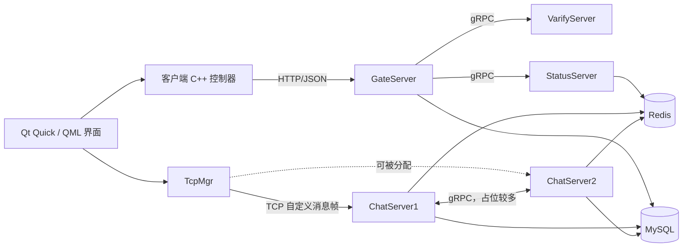

# SakuraChat 从零掌握路线图

更新说明（2026-09-08）：课程正文包含不同阶段的历史快照。当前好友功能以 [状态与代码导航](FRIEND_FEATURE_STATUS.md) 为准，具体修改步骤见 [适配教程](FRIEND_SEARCH_AND_APPLICATION_QML_TUTORIAL.md)。本次未构建或测试。

## 1. 学习目标

这份路线不是让你背项目介绍，而是让你最终具备以下能力：

1. 不看稿说明项目由哪些进程、模块和中间件组成。
2. 从一次界面操作出发，沿 QML、C++、HTTP、gRPC、TCP、Redis 和 MySQL 找到完整调用链。
3. 解释关键对象由谁创建、由谁持有、何时销毁，以及异步回调为什么不会立刻失效。
4. 解释 TCP 粘包、半包、消息帧、异步读写和服务端会话管理。
5. 解释线程、任务队列、互斥锁和条件变量的并发边界。
6. 能定位并修改一个实际缺陷，而不只是复述 AI 生成的代码。
7. 面试时只陈述项目中真实存在、自己能够继续追问的内容。

## 2. 先建立正确认识

SakuraChat 当前是一个学习型分布式聊天系统。账号链路和登录链路相对完整，好友和聊天链路尚未形成完整闭环。

| 功能 | 当前状态 | 可以学习或陈述的内容 |
| --- | --- | --- |
| 注册、验证码、重置密码 | 基本实现 | Qt 网络请求、GateServer HTTP 接口、验证码 RPC、MySQL |
| 账号密码登录 | 基本实现 | HTTP 登录、服务发现、Token、TCP 二次认证 |
| ChatServer 选择 | 已实现基础策略 | StatusServer、Redis 登录计数、最小连接数选择 |
| TCP 消息收发 | 登录及好友相关协议已接入代码，仍有服务端缺口 | 自定义消息帧、异步读写、会话对象、逻辑分发 |
| Redis 登录状态和缓存 | 部分实现 | Token、用户基础信息缓存、用户所在服务器路由 |
| 好友搜索与申请 | 搜索、申请 UI、共享 DAO 已接入；ChatServer1 缺少申请处理器定义 | QML/C++、Session 身份、DAO 与在线通知 |
| 好友审核、好友列表 | 审核事务与界面已接入，跨节点客户端与联系人同步仍缺失 | applyId、状态机、事务、登录快照及其容量边界 |
| 即时消息 | 界面骨架/接口占位 | 发送、转发、离线消息、确认机制尚不完整 |
| 生产级安全和稳定性 | 未完成 | 明文密码、敏感日志、断线清理、限流等仍需改进 |

因此，现阶段最适合深入讲解的主线是：

> 客户端启动 → QML/C++ 交互 → HTTP 登录 → StatusServer 分配节点 → Redis Token → TCP 连接 → ChatServer 鉴权 → 切换聊天界面

## 3. 项目全景

### 各进程的职责

- `SakuraChat`：Qt/QML 客户端，负责界面、HTTP 请求和 TCP 长连接。
- `GateServer`：HTTP 网关，处理注册、登录、重置密码等短请求。
- `VarifyServer`：验证码服务，项目中由 Node.js 实现。
- `StatusServer`：选择 ChatServer，生成并保存登录 Token。
- `ChatServer1/ChatServer2`：维护 TCP 会话，处理登录以及未来的好友和聊天消息。
- `MySQL`：持久化用户、好友、申请和消息等业务数据。
- `Redis`：保存 Token、用户缓存、在线路由和节点负载等临时状态。

## 4. 学习方法

每个阶段按同一套循环进行：

1. **读**：只阅读本阶段指定的少量入口文件。
2. **画**：画出调用者、被调用者、输入、输出和协议。
3. **改**：完成一个范围很小、可以解释的修改。
4. **查**：通过日志、断点或静态跟踪验证自己的判断。
5. **讲**：不用项目文档，连续讲 3～5 分钟。

判断自己是否掌握的标准不是“代码看过了”，而是：

- 能说出为什么这样设计；
- 能说出对象和数据的生命周期；
- 能指出至少一个风险；
- 能提出并完成一个小改动。

## 5. 分阶段学习计划

### 阶段 0：认识目录和真实完成度

**阅读顺序**

1. `SakuraChat/CMakeLists.txt`
2. `SakuraChat/main.cpp`
3. `Server` 下各服务的入口文件和配置文件
4. `docs/SYSTEM_ARCHITECTURE_AND_TECHNICAL_DESIGN.md`

**需要掌握**

- 哪些是独立进程，哪些只是进程内模块。
- 编译期依赖和运行期依赖的区别。
- HTTP、gRPC、TCP 分别用在什么边界。
- 哪些功能完成，哪些只是界面或接口占位。

**动手任务**

- 手画一张项目部署图。
- 为每个进程写一句职责说明。
- 找出好友与消息功能中的三个空实现或 TODO。

**过关标准**

两分钟内讲清项目全景，且不把未完成模块说成已完成。

阶段 0 的详细教材、定位练习和参考答案见 `LESSON_00_PROJECT_OVERVIEW.md`。

### 阶段 1：客户端启动和完整登录链路

**阅读顺序**

1. `SakuraChat/main.cpp`
2. `SakuraChat/qml/Main.qml`
3. `SakuraChat/qml/LoginDialog.qml`
4. `SakuraChat/src/logincontroller.cpp`
5. `SakuraChat/src/httpmgr.cpp`
6. `SakuraChat/src/tcpmgr.cpp`
7. `Server/GateServer/src/LogicSystem.cpp`
8. `Server/StatusServer/src/StatusServiceImpl.cpp`
9. `Server/ChatServer1/src/CSession.cpp`
10. `Server/ChatServer1/src/LogicSystem.cpp`

**需要掌握**

- `QQmlApplicationEngine` 如何加载 QML。
- `Q_INVOKABLE`、信号/槽、`Connections` 和上下文属性的作用。
- 为什么先走 HTTP，再建立 TCP 长连接。
- Token 如何生成、保存、传递和校验。
- 登录成功究竟应该以 HTTP 成功还是 TCP 鉴权成功为准。

**动手任务**

- 沿代码标记一次登录中所有 JSON 字段。
- 用断点或日志观察 HTTP 响应和 TCP 登录响应。
- 修正一个明确的界面状态切换错误，并说明影响。

**过关标准**

能够从“点击登录”连续讲到“聊天页面出现”，中间不跳过 StatusServer、Redis 和 ChatServer。

详细内容见 `LESSON_01_STARTUP_AND_LOGIN.md`。

### 阶段 2：TCP 消息帧、粘包与半包

**重点文件**

- `SakuraChat/src/tcpmgr.cpp`
- `Server/ChatServer1/src/CSession.cpp`
- `Server/ChatServer1/include/const.h`

**需要掌握**

- TCP 是字节流，为什么一次 `readyRead` 不等于一条业务消息。
- 当前消息帧由 2 字节消息 ID、2 字节正文长度和正文组成。
- 大端/小端和 `qToBigEndian`、`ntohs` 的对应关系。
- 服务端为什么先读固定长度头，再按头部长度读正文。
- 客户端缓存解析器目前可能在多帧场景中出错的原因。
- 为什么必须限制正文最大长度和消息 ID 范围。

**动手任务**

- 用纸模拟：半个头、完整头但半个正文、一次收到两帧。
- 重写客户端解析循环，使游标与缓存截取逻辑一致。
- 添加消息长度上限校验。

**过关标准**

能不用“粘包是 TCP 的 bug”这种错误说法，准确解释字节流与应用层分帧。

详细内容见 `LESSON_02_TCP_FRAMING_AND_STREAM_PARSING.md`。

### 阶段 3：异步网络与对象生命周期

**重点文件**

- `Server/ChatServer1/src/CServer.cpp`
- `Server/ChatServer1/src/CSession.cpp`
- `Server/ChatServer1/src/AsioIOServicePool.cpp`
- `SakuraChat/src/httpmgr.cpp`

**需要掌握**

- `io_context`、异步回调和事件循环的关系。
- `CSession` 为什么常与 `shared_ptr`、`shared_from_this()` 配合。
- 回调捕获裸 `this` 和捕获共享所有权的风险区别。
- Qt 中 `reply->deleteLater()` 为什么不是立即 `delete`。
- Session、Socket、Server、线程池各自的所有者。

**动手任务**

- 为核心对象画所有权图。
- 找出连接关闭时 Session 从哪里移除。
- 分析异常或错误分支是否可能泄漏、重复回调或悬空访问。

**过关标准**

能回答“异步操作尚未结束时，回调中的对象为什么还活着”。

详细内容见 `LESSON_03_ASYNC_NETWORKING_AND_OBJECT_LIFETIME.md`。

### 阶段 4：逻辑线程、队列和并发边界

**重点文件**

- `Server/ChatServer1/src/LogicSystem.cpp`
- `Server/ChatServer1/include/LogicSystem.h`

**需要掌握**

- 网络 I/O 线程与业务逻辑线程如何分工。
- 生产者—消费者队列的共享状态是什么。
- 互斥锁保护什么，条件变量等待什么条件。
- 为什么条件变量等待必须用循环或带谓词的 `wait`。
- 当前队列为什么不是“有界队列”，也没有真正背压。
- 停止标志、线程退出和析构顺序。

**动手任务**

- 画出 Push 与 DealMsg 的线程交互。
- 为队列增加容量、拒绝或降级策略，并定义可观察指标。
- 分析回调是否都在同一个逻辑线程执行。

**过关标准**

能明确指出共享状态、锁粒度、等待条件和退出路径。

详细内容见 `LESSON_04_THREADING_QUEUE_AND_CONCURRENCY.md`。

### 阶段 5：MySQL、Redis、gRPC 与节点路由

**重点文件**

- `Server/Common/message.proto`
- `Server/GateServer/src/StatusGrpcClient.cpp`
- `Server/StatusServer/src/StatusServiceImpl.cpp`
- `Server/ChatServer1/src/RedisMgr.cpp`
- `Server/ChatServer1/src/MysqlMgr.cpp`
- `database/schema.sql`

**需要掌握**

- protobuf 消息与 gRPC 服务如何定义。
- StatusServer 如何根据 Redis 中的登录计数选择节点。
- `_utoken<uid>`、`_ubaseinfo<uid>`、`_uip<uid>` 等键的含义。
- Cache Aside：先查 Redis，未命中再查 MySQL并回填。
- MySQL 连接池与 Redis 连接池试图解决什么问题。
- 节点计数和在线路由在异常断线时如何保持一致。

**动手任务**

- 整理所有 Redis 键的创建、读取、更新和删除位置。
- 跟踪一次缓存未命中。
- 找出断线时负载计数和路由清理是否完整。

**过关标准**

能解释“为什么 MySQL 已有用户，还要在 Redis 中保存 Token、缓存和路由”。

详细内容见 `LESSON_05_MYSQL_REDIS_GRPC_AND_ROUTING.md`。

### 阶段 6：注册、验证码和重置密码

**重点文件**

- 客户端 Register/Reset 控制器与对应 QML
- `Server/GateServer/src/LogicSystem.cpp`
- `Server/VarifyServer`

**需要掌握**

- 表单校验应该放在哪些层。
- 验证码请求为何通过 gRPC 调用独立服务。
- 注册、校验验证码、写库的错误处理。
- 密码明文存储与传输的风险，以及密码哈希的正确方向。

**动手任务**

- 列出注册接口所有错误码。
- 设计密码哈希迁移方案，但先不破坏现有兼容性。
- 为验证码增加过期、频率限制和失败次数限制的设计。

**过关标准**

能说明客户端校验不能替代服务端校验。

详细内容见 `LESSON_06_REGISTRATION_VERIFICATION_AND_PASSWORD_RESET.md`。

### 阶段 7：补齐好友和消息闭环

这一阶段不是“阅读已有完整实现”，而是基于现有骨架做真正的工程开发。

**建议顺序**

1. 用户搜索：客户端 → ChatServer → MySQL/Redis → 客户端。
2. 好友申请：写申请记录并通知目标用户。
3. 好友认证：事务更新申请和双向好友关系。
4. 好友列表：登录后拉取与缓存。
5. 单聊发送：消息落库、在线路由、跨 ChatServer 转发。
6. 离线消息：拉取、确认、状态更新和幂等。

**每个功能必须回答**

- 请求 ID 和响应 ID 是什么？
- JSON/protobuf 字段是什么？
- 数据表如何变化？
- 目标用户在线和离线分别怎么办？
- 重试会不会重复写入？
- 跨节点时通过什么协议转发？

**过关标准**

至少独立完成一条端到端功能，并能展示提交、日志和数据变化。

详细内容见 `LESSON_07_FRIENDSHIP_AND_MESSAGING_CLOSURE.md`。

### 阶段 8：安全、稳定性、验证与面试表达

**重点改进项**

- 密码哈希与敏感信息脱敏。
- Token 过期与撤销。
- 输入长度、消息 ID 和 JSON 类型校验。
- TCP 心跳、超时、重连和断线状态清理。
- 有界队列、限流和过载保护。
- 结构化日志、请求关联 ID 和关键指标。
- 单元测试、协议解析测试和服务集成测试。

**过关标准**

可以用“问题—约束—方案—取舍—验证”讲一个自己亲手完成的改进。

详细内容见 `LESSON_08_SECURITY_RELIABILITY_VERIFICATION_AND_INTERVIEW.md`。

### 进阶实战 9：Session 生命周期与断线恢复

基础篇完成后，选择一个真实问题进入工程实战。本阶段聚焦：

- Session 所有权与状态机；
- 幂等关闭和新旧连接竞态；
- UserMgr/Redis 条件清理；
- 节点计数最终一致；
- Qt 客户端心跳与退避重连。

详细内容见 `LESSON_09_SESSION_LIFECYCLE_AND_DISCONNECT_RECOVERY_LAB.md`。

## 6. 建议的四周节奏

| 周次 | 主题 | 可交付结果 |
| --- | --- | --- |
| 第 1 周 | 阶段 0～1 | 架构图、登录时序图、5 分钟口述 |
| 第 2 周 | 阶段 2～4 | 修复 TCP 解析器、所有权图、并发说明 |
| 第 3 周 | 阶段 5～6 | Redis 键表、数据库链路、账号安全改进设计 |
| 第 4 周 | 阶段 7～8 | 独立补齐一条功能，形成可验证的项目成果 |

如果基础薄弱，可以把每一周拉长为两周。进度快慢不重要，关键是每阶段都必须完成一次真实修改和一次口述。

## 7. 简历陈述边界

在尚未亲自完成代码修改前，建议只说：

- 阅读并梳理了 Qt/QML 客户端与多服务端架构；
- 能解释登录、服务发现、Token 鉴权和 TCP 会话链路；
- 正在针对协议解析、生命周期或断线清理做工程改进。

完成并验证对应改动后，才适合写：

- 修复 TCP 多帧/半包解析问题；
- 引入消息长度校验和异常连接处理；
- 完善会话退出时 Redis 路由与负载计数清理；
- 实现好友搜索或申请的端到端闭环。

暂时不要写：

- “高并发分布式即时通信系统”——目前没有可靠压测数据与完整稳定性建设。
- “实现完整好友与即时消息系统”——当前后端存在大量空实现。
- “无锁队列/背压”——现有逻辑队列使用互斥锁且无容量上限。
- 无基线的性能提升百分比。

## 8. 每次学习后的自检模板

学完一个模块后，用自己的话回答：

1. 这个模块解决什么问题？
2. 谁调用它，它又调用谁？
3. 输入、输出和错误分别是什么？
4. 数据保存在哪里，生命周期多长？
5. 哪个线程执行？共享状态受什么保护？
6. 对象由谁拥有，何时销毁？
7. 最可能出错的三个边界是什么？
8. 我亲自改了什么，如何验证？
9. 为什么选择这个方案？还有什么替代方案？
10. 面试官继续追问五分钟，我是否还能结合代码回答？

只有第 8 项有真实答案时，这个知识点才开始属于你，而不只是属于项目或 AI。
