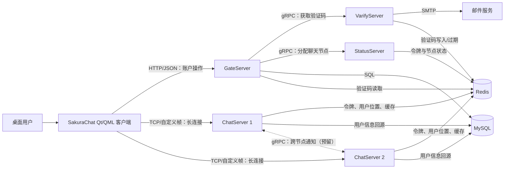
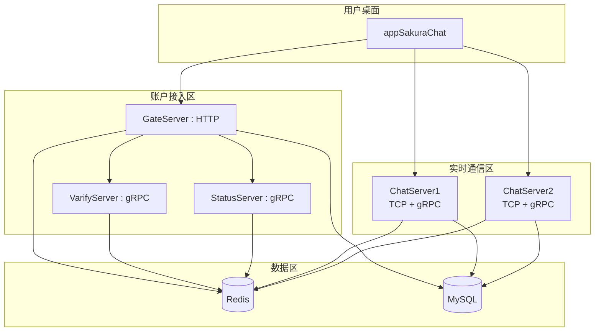
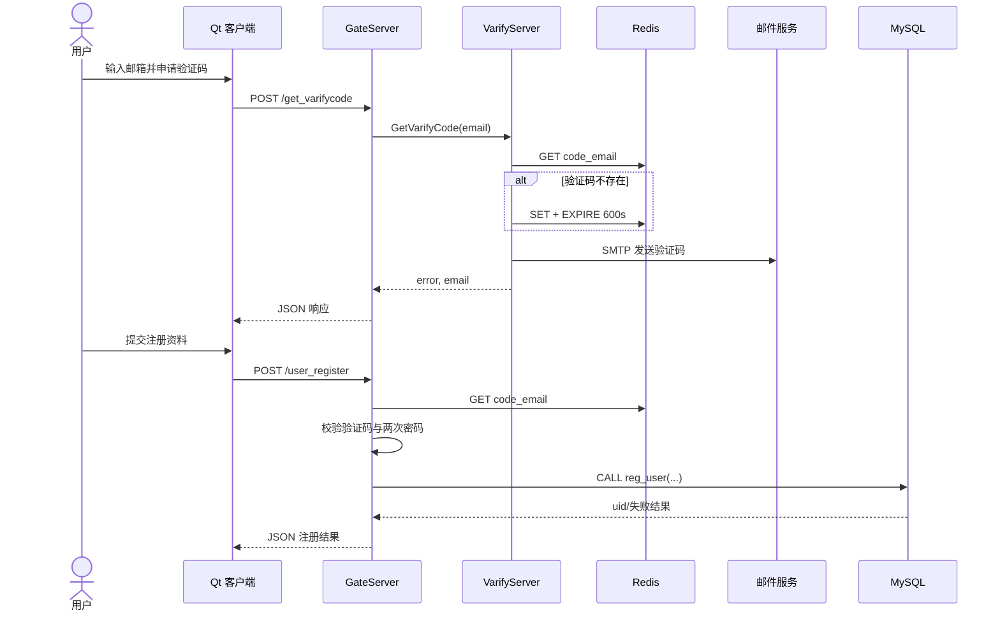
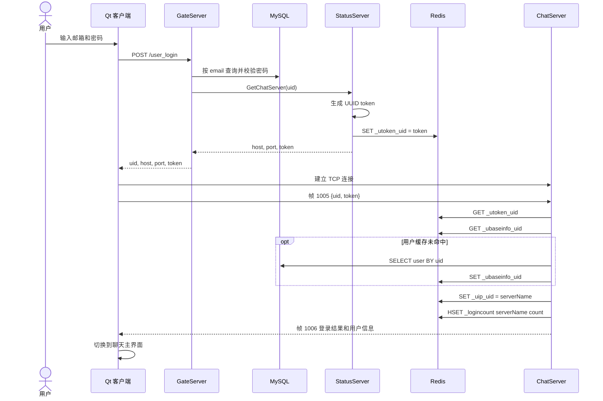
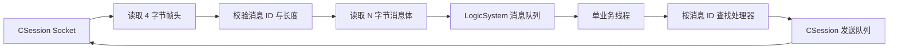
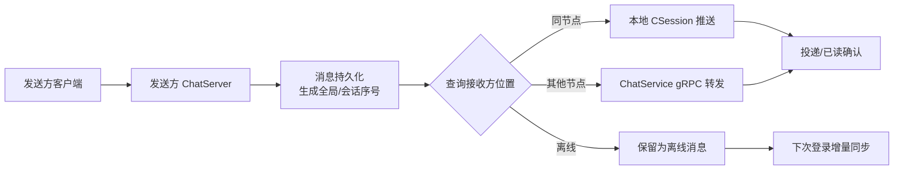

# SakuraChat 系统架构与技术设计文档

## 1. 文档信息

| 项目 | 内容 |
| --- | --- |
| 文档名称 | SakuraChat 系统架构与技术设计文档 |
| 文档版本 | 1.1 |
| 编制日期 | 2026-08-08 |
| 更新日期 | 2026-09-08 |
| 分析范围 | `SakuraChat/` 桌面客户端与 `Server/` 服务端源码 |
| 技术基线 | Qt 6.8、C++17、CMake、Boost.Asio/Beast、gRPC/Protobuf、MySQL、Redis、Node.js |
| 文档性质 | 基于当前仓库代码的现状架构说明，不代表所有预留功能均已完成 |

### 1.1 状态标记

本文使用以下标记区分代码现状：

- **已实现**：存在完整的入口、处理链路和结果返回。
- **部分实现**：存在协议、接口或界面，但链路尚未闭合。
- **预留**：仅存在类型、空实现或注释中的规划。

本次静态核对客户端 7fc7faf、服务端 40950c6，未构建或测试。好友链路的代码状态、缺失定义和运行边界见 [好友功能当前状态](FRIEND_FEATURE_STATUS.md)；“存在实现”不等于端到端验收通过。

### 1.2 设计依据

主要代码依据包括：

- 客户端入口与构建：`SakuraChat/main.cpp`、`SakuraChat/CMakeLists.txt`
- 客户端网络与控制器：`SakuraChat/src/httpmgr.*`、`tcpmgr.*`、`*controller.*`
- 网关：`Server/GateServer/`
- 状态服务：`Server/StatusServer/`
- 聊天节点：`Server/ChatServer1/`、`Server/ChatServer2/`
- 公共基础设施：`Server/Common/`
- 验证码服务：`Server/VarifyServer/`
- 完整协议：`Server/VarifyServer/message.proto`；C++ 实际编译 Common 中的生成文件，旧 Common/message.proto 不含完整 ChatService

### 1.3 关联文档

- `docs/INTERFACE_DESIGN.md`：HTTP、TCP、gRPC 与 QML/C++ 接口契约。
- `docs/DATA_DESIGN.md`：MySQL、Redis、客户端内存模型与数据生命周期。

## 2. 系统概述

SakuraChat 是一套桌面即时通信系统。系统将账户类短事务和实时会话拆分为两条链路：

1. 客户端通过 HTTP 访问 GateServer，完成验证码申请、注册、密码重置和账户登录。
2. GateServer 在登录成功后向 StatusServer 获取聊天节点地址和临时令牌。
3. 客户端连接指定 ChatServer 的 TCP 端口，以自定义二进制帧承载 JSON 消息。
4. 多个 ChatServer 通过 Redis 共享令牌、用户所在节点和连接计数，并预留 gRPC 跨节点消息转发能力。

当前代码已经打通账户注册、密码重置、HTTP 登录、聊天节点分配和 TCP 二次认证。好友搜索、申请、审核、离线申请快照和 QML 红点已有代码；ChatServer1 的申请处理器定义和跨节点审核 RPC 客户端仍缺失。联系人同步与跨用户文本消息链路尚未完成。

## 3. 架构目标与约束

### 3.1 当前设计目标

- 以 Qt Quick/QML 构建桌面 UI，以 C++ 负责网络和状态管理。
- HTTP 与 TCP 分离，避免账户事务和长连接消息相互影响。
- 使用多个聊天节点承载横向扩展。
- 使用 Redis 共享临时状态，使用 MySQL 保存账户主数据。
- 通过异步 I/O、连接池和消息队列降低阻塞范围。
- 通过 Protobuf 定义服务间契约。

### 3.2 当前约束

- 客户端要求 Qt 6.8，服务端要求 C++17 和 CMake 3.20。
- 服务端构建文件包含本机 `D:/environment/...` 形式的 Windows 绝对依赖路径，可移植性有限。
- HTTP、TCP 和 gRPC 当前均为明文通信。
- 配置依赖各进程工作目录中的 `config.ini`；验证码服务另依赖 `config.json`。
- 根目录 database 已有 schema 和迁移入口；容器编排、自动化部署和自动化测试基线仍待完善。

## 4. 总体架构

### 4.1 系统上下文



### 4.2 容器与职责

| 组件 | 技术 | 对外接口 | 主要职责 | 当前状态 |
| --- | --- | --- | --- | --- |
| SakuraChat Client | Qt 6.8、QML、C++ | HTTP、TCP | UI、表单校验、账户请求、TCP 会话、客户端状态 | 部分实现 |
| GateServer | C++、Boost.Beast/Asio | HTTP/JSON | 账户 API、验证码编排、MySQL 访问、聊天节点申请 | 已实现 |
| VarifyServer | Node.js、grpc-js | gRPC | 生成验证码、写入 Redis、发送邮件 | 已实现 |
| StatusServer | C++、gRPC | gRPC | 生成登录令牌、选择聊天节点、记录令牌 | 部分实现 |
| ChatServer1/2 | C++、Boost.Asio、gRPC | TCP、gRPC | 长连接、TCP 拆包组包、二次认证、会话注册、节点间通知 | 部分实现 |
| Common | C++ 静态库 | 内部链接 | 配置、Redis/MySQL、Asio 线程池、Status gRPC 客户端、协议生成代码 | 已实现 |
| MySQL | 外部基础设施 | SQL | 用户账户主数据 | 已使用，缺少建库脚本 |
| Redis | 外部基础设施 | Redis 协议 | 验证码、登录令牌、用户节点位置、连接数、用户缓存 | 已使用 |

### 4.3 部署拓扑



当前仓库定义两个聊天进程，其业务源码基本一致，通过各自 `config.ini` 的 `SelfServer` 配置区分节点名称、TCP 端口和 gRPC 端口。

## 5. 客户端技术设计

### 5.1 分层结构

| 层次 | 主要文件 | 职责 |
| --- | --- | --- |
| 表现层 | `qml/*.qml` | 登录、注册、重置、聊天、联系人、好友申请等 UI 与交互 |
| 业务协调层 | `logincontroller.*`、`registercontroller.*`、`resetcontroller.*` | 组装请求、解释响应、向 QML 发射结果信号 |
| 网络层 | `httpmgr.*`、`tcpmgr.*` | HTTP POST、TCP 连接、组帧、拆帧、消息分派 |
| 状态与模型层 | `usermgr.*`、`chatuserlist.*`、`contactuserlist.*`、`applyfriendlist.*` | 当前用户状态和 QML Model/View 数据 |
| 配置层 | `configmanager.*` | 从应用目录读取网关地址 |

### 5.2 UI 组织

`Main.qml` 使用 `StackLayout` 管理登录、注册、密码重置和聊天四个主视图。聊天主界面由 `ChatDialog.qml` 组织侧边导航、最近会话、联系人、好友申请、搜索、消息列表和输入区。

客户端通过 `QML_ELEMENT`、`QML_SINGLETON` 和 `qt_add_qml_module` 向 QML 暴露 C++ 类型。`TcpMgr` 同时被注册为 QML 单例，并由 `main.cpp` 设置为上下文属性，属于重复暴露方式，后续应统一。

当前 UI 完成度：

- 登录、注册和密码重置已连接真实 HTTP 接口。
- 登录后的 TCP 连接及二次认证已连接真实服务。
- 最近会话和联系人仍有演示数据；申请页已接入网络数据、applyId 去重和状态角色。
- 搜索防抖调用 TcpMgr.searchUser；资料弹窗打开申请弹窗，审核结果成功后才修改模型状态。
- 发送文本目前仅调用 `chatView.appendMessage()` 更新本地界面，TCP 发送逻辑被注释。

### 5.3 HTTP 管理

`HttpMgr` 以单例持有 `QNetworkAccessManager`：

1. 控制器提交 URL、JSON、请求 ID 和模块 ID。
2. `HttpMgr` 异步执行 POST。
3. 完成后发出统一 `sig_http_finish`。
4. `slot_http_finish` 根据模块转发到注册、重置或登录控制器。
5. 控制器按请求 ID 查找回调并向 QML 发出业务结果。

该实现避免阻塞 UI 线程，但当前没有统一超时、重试、取消、HTTP 状态码映射和请求追踪 ID。

### 5.4 TCP 管理与帧协议

`TcpMgr` 持有单个 `QTcpSocket`，负责连接由 StatusServer 分配的 ChatServer。

帧格式如下：

```text
+----------------+----------------+----------------------+
| Message ID     | Body Length    | UTF-8 JSON Body      |
| uint16, 2 byte | uint16, 2 byte | N byte               |
+----------------+----------------+----------------------+
  Big Endian       Big Endian
```

服务端常量约束：

- 帧头长度：4 字节。
- 消息 ID：2 字节。
- 消息体长度：2 字节。
- 单条消息体上限：2048 字节。
- 单会话发送队列上限：1000 条。
- 当前已注册消息：`1005` 聊天登录、`1006` 聊天登录响应。

客户端使用缓冲区处理粘包和半包；服务端通过“读取完整帧头—解析长度—读取完整消息体”处理流式 TCP 数据。

## 6. 服务端技术设计

### 6.1 Common 公共库

`Server/Common` 构建为静态库，向多个 C++ 服务提供：

- `ConfigMgr`：读取当前工作目录下的 INI 配置。
- `AsioIOServicePool`：按硬件并发数创建 `io_context` 与工作线程，轮询分配连接。
- `MysqlDao`：MySQL Connector/C++ 连接池和账户数据访问。
- `RedisMgr`：hiredis 连接池及字符串、列表、哈希操作。
- `StatusGrpcClient`：GateServer 到 StatusServer 的 gRPC Stub 池。
- Protobuf/gRPC 生成代码。

MySQL、Redis 和 gRPC Stub 池的当前默认规模均为 5 个连接或 Stub。

### 6.2 GateServer

GateServer 是客户端账户 API 的入口：

- `CServer` 接收 TCP 连接，并将连接轮询分配给 Asio I/O 线程。
- `HttpConnection` 使用 Boost.Beast 异步读取和写入 HTTP，请求截止时间为 60 秒。
- `LogicSystem` 维护路径到处理函数的注册表。
- `VerifyGrpcClient` 调用验证码服务。
- `StatusGrpcClient` 调用状态服务。
- `MysqlMgr` 和 `RedisMgr` 访问持久化与缓存。

当前进程虽然尝试读取 `[GateServer]` 端口配置，但读取键名与现有配置的大小写也不一致；实际监听端口在 `main()` 中硬编码为 `8081`，配置值没有用于创建监听器。

### 6.3 VarifyServer

VarifyServer 是 Node.js gRPC 服务，提供 `GetVarifyCode`：

1. 以 `code_<email>` 查询 Redis。
2. 如果不存在，生成 UUID 并截取前 4 个字符。
3. 将验证码写入 Redis，并设置 600 秒过期时间。
4. 通过 Nodemailer 和 SMTP 发送邮件。
5. 返回邮箱与错误码，不返回验证码正文。

若同一邮箱在有效期内重复申请，服务会复用原验证码并再次发送。邮件正文声称 3 分钟有效，但代码过期时间为 10 分钟，需要统一。

### 6.4 StatusServer

StatusServer 提供聊天节点发现和令牌签发：

- 启动时从 `[ChatServers]` 和各聊天节点配置区加载节点列表。
- `GetChatServer(uid)` 返回节点主机、TCP 端口和随机 UUID 令牌。
- 令牌以 `_utoken<uid>` 写入 Redis。
- `Login(uid, token)` 可校验 Redis 中的令牌，但 ChatServer 当前直接访问 Redis，未调用该 RPC。

代码中已经保留按 Redis 连接数选择最空闲节点的算法，但目前整段负载比较逻辑被注释，实际始终返回容器中的第一个节点。因此，当前“双聊天节点”不等于已经具备有效负载均衡。

### 6.5 ChatServer

每个 ChatServer 同时监听：

- 面向客户端的 TCP 长连接端口。
- 面向其他服务的 gRPC 端口。

内部组件如下：

| 组件 | 职责 |
| --- | --- |
| `CServer` | 接受连接、维护 `sessionId -> CSession` 映射、清理断开会话 |
| `CSession` | TCP 异步读写、帧解析、发送队列、会话关闭 |
| `LogicSystem` | 单独工作线程消费业务消息队列，并按消息 ID 分派 |
| `UserMgr` | 维护本节点 `uid -> CSession` 在线映射 |
| `ChatServiceImpl` | 接收跨节点 gRPC 通知 |
| `ChatGrpcClient` | 为对端 ChatServer 建立 gRPC Stub 池 |
| `MysqlMgr` / `RedisMgr` | 用户信息回源、令牌校验、共享在线状态 |

TCP 登录成功后，ChatServer：

1. 校验 Redis 中 `_utoken<uid>` 与客户端令牌。
2. 从 `_ubaseinfo<uid>` 读取用户缓存；未命中则查询 MySQL 并回填 Redis。
3. 将本节点登录数加一。
4. 将 `_uip<uid>` 设置为当前服务器名称。
5. 将用户会话注册到 `UserMgr`。
6. 查询待处理申请并填充 apply_list，返回 `1006` 登录响应。

LogicSystem 已注册登录、搜索、申请与审核；但 ChatServer1 缺少 AddFriendApply 定义。登录成功时查询至多 200 条待处理申请并放入 rtvalue.apply_list。NotifyAddFriend 调用与接收实现存在；NotifyAuthFriend 接收端存在、RPC 客户端仍为空；文本 RPC 仍预留。

## 7. 核心业务流程

### 7.1 获取验证码与注册



### 7.2 登录、节点分配与 TCP 二次认证



### 7.3 TCP 入站处理



这种设计将网络 I/O 与业务处理隔离，但单个 ChatServer 当前只有一个业务消费线程；当数据库、Redis 或复杂业务回调阻塞时，所有业务消息会排队。

## 8. 接口与协议设计

### 8.1 HTTP API

所有业务接口当前均为 JSON POST；`/get_test` 是 GET 测试接口。

| 路径 | 请求主要字段 | 响应主要字段 | 后端依赖 | 状态 |
| --- | --- | --- | --- | --- |
| `GET /get_test` | Query 参数 | 测试文本 | 无 | 已实现，测试用途 |
| `POST /get_varifycode` | `email` | `error`, `email` | VarifyServer、Redis、SMTP | 已实现 |
| `POST /user_register` | `username`, `email`, `varifycode`, `password`, `confirm` | `error`, `uid`, `email`, `username` 等 | Redis、MySQL | 已实现 |
| `POST /reset_pwd` | `user`, `email`, `passwd`, `varifycode` | `error`, `email`, `user` 等 | Redis、MySQL | 已实现 |
| `POST /user_login` | `email`, `passwd` | `error`, `uid`, `host`, `port`, `token` | MySQL、StatusServer、Redis | 已实现 |

业务错误码由服务端 `ErrorCodes` 定义，范围为 `1001` 至 `1011`；客户端自身网络和 JSON 错误使用 `1`、`2`。目前没有统一的跨端错误契约文件，建议收敛为一套稳定定义。

### 8.2 TCP 消息

| 消息 ID | 方向 | 消息体 | 状态 |
| --- | --- | --- | --- |
| `1005` | Client → ChatServer | JSON：`uid`, `token` | 已实现 |
| `1006` | ChatServer → Client | JSON：`error` 及用户基础信息 | 已实现 |

好友 TCP ID 已使用 1007/1008 搜索、1009/1010 申请、1011 申请通知、1012/1013 审核、1014 审核通知；1006 携带 apply_list。联系人同步和文本消息仍待设计接入，完整字段见接口文档。

### 8.3 gRPC 服务

| Service / RPC | 调用方 → 提供方 | 用途 | 状态 |
| --- | --- | --- | --- |
| `VarifyService.GetVarifyCode` | Gate → Varify | 获取并发送邮箱验证码 | 已实现 |
| `StatusService.GetChatServer` | Gate → Status | 获取聊天节点和登录令牌 | 已实现 |
| `StatusService.Login` | Chat → Status | 校验聊天登录令牌 | 已实现但未接入当前 Chat 登录链路 |
| `ChatService.NotifyAddFriend` | Chat → Chat | 跨节点好友申请通知 | 调用和接收代码存在，调用设 3 秒 deadline |
| `ChatService.NotifyAuthFriend` | Chat → Chat | 跨节点好友确认通知 | 接收端存在，RPC 客户端为空，链路未闭合 |
| `ChatService.NotifyTextChatMsg` | Chat → Chat | 跨节点文本消息通知 | 预留空实现 |

协议定义使用 Protobuf，但仓库同时保留多个 `message.proto` 和生成文件副本。应建立单一协议源，并在构建时自动生成各语言代码。

## 9. 数据设计

### 9.1 MySQL

当前源码可确认的账户数据结构如下，字段完整约束需要以实际数据库为准：

| 对象 | 字段/操作 | 用途 |
| --- | --- | --- |
| `user` 表 | `uid`, `name`, `email`, `pwd`，以及代码结构预留的 `nick`, `desc`, `gender`, `icon`, `back` | 用户主数据 |
| `reg_user` 存储过程 | `name`, `email`, `pwd`, 输出结果 | 注册用户并返回 UID |

数据访问均使用预编译语句，主要操作包括：

- 按用户名查询邮箱。
- 按用户名更新密码。
- 按邮箱查询用户并校验密码。
- 按 UID 或用户名查询用户。

根目录 database/schema.sql 已定义用户、好友、申请与消息相关 DDL、唯一索引、外键和存储过程；共享 MysqlDao 已接入好友申请、审核及待处理查询，消息业务尚未接入。该脚本会删除并重建 skrchat，不是无损升级脚本；实际部署状态未核对。

### 9.2 Redis

| Key 模式 | 类型 | 值 | 过期策略 | 写入方/读取方 |
| --- | --- | --- | --- | --- |
| `code_<email>` | String | 4 字符验证码 | 600 秒 | Varify 写；Gate 读 |
| `_utoken<uid>` | String | UUID 登录令牌 | 当前无 TTL | Status 写；Chat/Status 读 |
| `_uip<uid>` | String | ChatServer 名称 | 当前无 TTL | Chat 写；跨节点路由预留读取 |
| `_ubaseinfo<uid>` | String/JSON | 用户基础信息 | 当前无 TTL | Chat 读写 |
| `_logincount` | Hash | `serverName -> count` | 无 TTL | Chat 写；Status 负载均衡预留读取 |

一致性注意事项：

- ChatServer 登录时增加连接数，但会话断开时没有对应减计数逻辑，计数会持续偏高。
- 用户节点位置和用户缓存没有过期或下线清理。
- 令牌没有 TTL，也没有成功登录后轮换或删除。
- 密码当前会被放入用户缓存和登录响应，不应作为聊天会话资料传播。

## 10. 并发与资源模型

### 10.1 GateServer

- 主 `io_context` 负责监听。
- `AsioIOServicePool` 默认按 CPU 硬件并发数创建 I/O 线程。
- 新连接以轮询方式绑定到池中的 `io_context`。
- 每个 `HttpConnection` 使用异步读写和 60 秒截止计时器。
- MySQL、Redis、gRPC 使用固定规模连接池。

### 10.2 ChatServer

- 主 `io_context` 接受客户端连接。
- 会话 Socket 分配到 Asio I/O 线程池。
- 每个会话有独立发送队列和互斥锁，保证同一 Socket 串行发送。
- 所有解帧后的业务消息进入一个共享队列，由单独线程消费。
- 在线会话表和 UID 会话表分别由互斥锁保护。
- gRPC 服务在独立线程中等待请求。

### 10.3 背压与边界

- 服务端消息体最大 2048 字节，暂不适合直接承载图片或大附件。
- 单会话发送队列超过 1000 条后直接丢弃新消息，当前没有通知客户端。
- `MAX_RECVQUE` 已定义为 10000，但业务入站队列没有实际容量检查。
- 业务消费者为单线程，缺少超时隔离和任务优先级。

## 11. 配置、构建与运行

### 11.1 配置分区

| 配置区 | 使用方 | 内容 |
| --- | --- | --- |
| `[GateServer]` | 客户端、Gate | HTTP 主机和端口 |
| `[VarifyServer]` | Gate | 验证码 gRPC 地址 |
| `[StatusServer]` | Gate、Status | 状态 gRPC 地址 |
| `[MySQL]` | C++ 服务 | 地址、用户、密码、Schema |
| `[Redis]` | C++ 服务 | 地址、端口、密码 |
| `[ChatServers]` | Status | 可分配聊天节点列表 |
| `[SelfServer]` | Chat | 当前节点名称、TCP 和 gRPC 地址 |
| `[PeerServer]` | Chat | 对端聊天节点列表 |
| `config.json` | Varify | 邮箱、MySQL、Redis 配置 |

文档不记录配置文件中的实际凭据。生产环境应改用密钥管理或环境注入，并立即轮换曾提交到仓库的凭据。

### 11.2 构建产物

| 目录 | 产物 |
| --- | --- |
| `SakuraChat/` | `appSakuraChat` Qt 桌面应用 |
| `Server/Common/` | `Common` 静态库 |
| `Server/GateServer/` | `GateServer` |
| `Server/StatusServer/` | `StatusServer` |
| `Server/ChatServer1/` | `ChatServer1` |
| `Server/ChatServer2/` | `ChatServer2` |
| `Server/VarifyServer/` | `node server.js` 进程 |

主要依赖：Qt Core/Gui/Quick/QuickControls2/Network、Boost 1.88、JsonCpp、gRPC、Protobuf、Abseil、hiredis、MySQL Connector/C++；Node 侧依赖 grpc-js、proto-loader、ioredis、nodemailer 和 uuid。

### 11.3 推荐启动顺序

1. 启动 MySQL，并准备 `user` 表和 `reg_user` 存储过程。
2. 启动 Redis。
3. 启动 VarifyServer。
4. 启动 StatusServer。
5. 启动 ChatServer1 和 ChatServer2。
6. 启动 GateServer。
7. 启动桌面客户端。

当前没有健康检查和服务依赖等待机制，启动失败主要通过标准输出发现。

## 12. 安全设计评估

当前实现适合开发验证，不满足互联网生产环境的安全要求。主要问题如下：

| 优先级 | 风险 | 代码现状 | 建议 |
| --- | --- | --- | --- |
| P0 | 明文密码 | 密码通过 HTTP/JSON 传输，数据库按明文比较，并进入日志、Redis 缓存和部分响应 | 全链路 TLS；使用 Argon2id/bcrypt 加盐哈希；禁止返回、缓存和记录密码 |
| P0 | 凭据入库 | INI/JSON 中包含数据库、Redis、SMTP 凭据 | 从版本库移除，轮换凭据，接入密钥管理 |
| P0 | 明文服务通信 | HTTP、TCP 和 gRPC 均未启用 TLS | 外部使用 HTTPS/TLS，内部使用 mTLS 或受控服务网格 |
| P1 | 令牌长期有效 | Redis 登录令牌没有 TTL、撤销和单次使用机制 | 设置短 TTL，登录成功后轮换/消费，绑定设备和会话 |
| P1 | 验证码防滥用不足 | 无发送频率、IP、邮箱和尝试次数限制 | 增加限流、失败计数、验证码哈希存储和一次性消费 |
| P1 | 日志泄密 | 当前打印请求体、密码、token、Redis 配置和值 | 结构化脱敏日志，禁止输出秘密字段 |
| P1 | 输入校验不足 | 服务端主要检查 JSON 能否解析，字段类型、长度和缺失校验不完整 | 建立统一 DTO 校验、大小限制和错误响应 |
| P2 | 会话状态残留 | 下线不清除 `_uip`，不减少 `_logincount` | 原子化上下线脚本、心跳、租约和故障清理 |

## 13. 可用性、可观测性与测试现状

### 13.1 可用性

- 多 ChatServer 拓扑已经具备，但节点选择和跨节点消息转发尚未完成。
- Gate、Status、Varify 均为单实例设计，没有故障转移逻辑。
- Redis 和 MySQL 是共享单点依赖，仓库未定义高可用方案。
- 客户端没有断线重连、心跳、消息重发和离线消息恢复机制。

### 13.2 可观测性

当前主要使用 `std::cout`、`qDebug` 和 `console.log`，尚无：

- 结构化日志与日志级别。
- 请求/会话追踪 ID。
- 指标、健康检查和告警。
- 分布式链路追踪。
- 审计日志和安全事件记录。

建议至少建立连接数、登录成功率、接口延迟、Redis/MySQL 池等待、消息队列深度、发送队列丢弃量和 gRPC 错误率指标。

### 13.3 测试

仓库未发现单元测试、集成测试或端到端测试目标。最低测试基线应覆盖：

- TCP 粘包、半包、零长度、超长和非法消息 ID。
- 注册、验证码过期、重置和登录错误码。
- Redis/MySQL 不可用与连接池耗尽。
- 多终端重复登录和会话清理。
- 多 ChatServer 路由、节点故障和跨节点消息。
- 客户端网络超时、断线重连与 UI 状态恢复。

## 14. 已知实现差距

### 14.1 功能差距

- 文本消息只在客户端本地追加，没有真实发送和持久化。
- ChatServer1 缺少 AddFriendApply 定义，两个节点源码仍不完全一致。
- 审核跨节点 RPC 客户端为空，申请人 QML 没有消费审核通知，联系人同步未闭合。
- 登录申请同步只取前 200 条；实时变化不回写快照；断线 pending 复位方法未接入。
- 消息表、回执、序号和 Outbox 已有 SQL 设计，但业务收发及可靠投递未接入。
- 没有心跳、在线状态续租和断线重连。

### 14.2 架构与工程差距

- StatusServer 当前固定返回第一个聊天节点。
- ChatServer 连接断开时未完整清理 Redis 状态和连接计数。
- GateServer 忽略配置端口并硬编码 `8081`。
- ChatServer1/2 复制同一套源文件，容易产生版本漂移。
- 协议文件和生成代码存在多份副本。
- 构建系统依赖开发机绝对路径和 Debug 静态库。
- 配置管理会将全部配置打印到日志，包括秘密字段。
- 有数据库脚本但缺少自动化迁移管理；CI/CD、部署描述、测试和运行手册仍需完善。
- `Main.qml` 中登录页的 `onSwitchRegister` 当前切换到聊天页，而不是注册页。

## 15. 推荐目标架构与演进路线

### 15.1 第一阶段：修复生产阻断项

1. 移除仓库秘密并轮换所有凭据。
2. 密码改为强哈希存储，删除响应、缓存和日志中的密码。
3. 为外部接口启用 TLS，为内部 gRPC 启用认证。
4. 统一配置入口，修复 Gate 端口硬编码。
5. 为 token 设置 TTL 和一次性消费策略。
6. 补齐服务端输入校验、限流、超时和统一错误契约。

### 15.2 第二阶段：闭合即时通信链路

1. 定义统一的客户端 TCP 消息协议与版本字段。
2. 实现文本消息发送、确认、去重和消息持久化。
3. 补齐好友申请与审核链路缺口、分页和断线状态，再实现联系人同步。
4. 使用 `_uip<uid>` 判断接收方节点：本节点直接推送，跨节点调用 ChatService，离线则持久化。
5. 增加心跳、断线检测、自动重连和离线消息拉取。
6. 对 Redis 在线状态使用 TTL/租约，而不是永久 Key。

### 15.3 第三阶段：可扩展性与工程化

1. 合并 ChatServer1/2 为同一可执行文件，通过配置启动多个实例。
2. 恢复并完善 StatusServer 的最少连接或一致性哈希分配算法。
3. 将单业务线程演进为有界工作池，并为用户或会话保持消息顺序。
4. 将协议源集中到独立目录，在构建阶段生成 C++/Node 代码。
5. 以包管理器或工具链文件替代绝对依赖路径。
6. 引入容器化、健康检查、滚动发布、自动化迁移和 CI 测试。
7. 建立结构化日志、指标、追踪和告警。

### 15.4 建议的消息投递模型



关键原则：消息先获得稳定 ID 并持久化，再尝试在线投递；客户端使用消息 ID 幂等处理，服务端使用会话序号保证顺序。

## 16. 目录职责映射

```text
SakuraChatProject/
├─ SakuraChat/                 # Qt/QML 桌面客户端
│  ├─ main.cpp                 # 客户端入口
│  ├─ qml/                     # 页面和可复用组件
│  ├─ src/                     # 控制器、网络、模型、状态和配置
│  └─ CMakeLists.txt           # Qt 构建定义
├─ Server/
│  ├─ Common/                  # 公共静态库、数据访问、协议生成代码
│  ├─ GateServer/              # HTTP 账户网关
│  ├─ StatusServer/            # 节点分配与令牌服务
│  ├─ ChatServer1/             # 聊天节点实例 1
│  ├─ ChatServer2/             # 聊天节点实例 2
│  ├─ VarifyServer/            # Node.js 邮箱验证码服务
│  └─ CMakeLists.txt           # C++ 服务端聚合构建
└─ docs/
   └─ SYSTEM_ARCHITECTURE_AND_TECHNICAL_DESIGN.md
```

## 17. 架构结论

当前项目已经形成清晰的“账户网关 + 状态服务 + 多聊天节点 + Redis/MySQL”分布式即时通信雏形，并完成登录链路所需的主要基础设施。Qt 客户端、异步网络层、连接池、TCP 帧协议、服务发现和二次认证的职责边界总体明确。

现阶段最主要的问题不是组件缺失，而是业务闭环、状态一致性和生产安全尚未完成。后续应优先处理秘密与密码安全、TLS、令牌生命周期和状态清理，再补齐消息持久化、跨节点投递、离线同步和可观测性；完成这些工作后，系统才具备面向真实用户稳定运行的基础。
